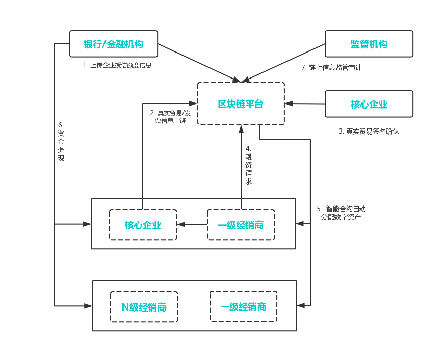
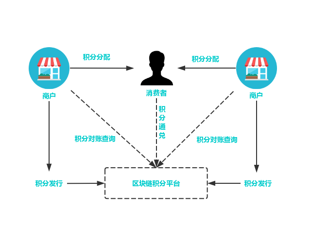
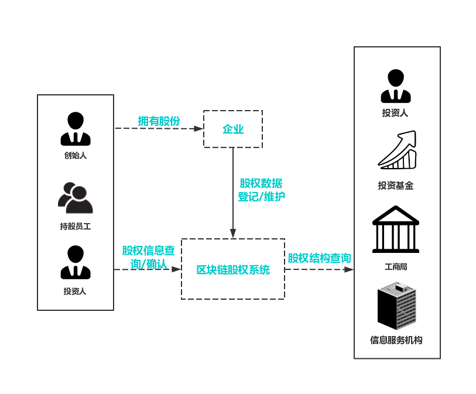

# 应用案例集

基于Venachain联盟链基础平台，利用其提供的技术特性，可以实施开展和行业相契合的各种业务场景，包括如下方面。

## 1. 供应链金融

可为供应链上下游企业构建一个信息对称共享、核心企业信用价值可传递、商票可拆分流程、风险可控的新型供应链金融融资模式，并为监管提供数据追溯便利，提升行业整体服务效率。

**传统供应链金融的痛点**:

（1）监管难以穿透

供应链层级的繁复，使贸易真实性和交易透明性无法简单通过系统进行确认和审核，造成了监管的不便利性。

（2）商票不可拆分、流转

传统的商票不可拆分，供应商无法基于商票再次背书转让，核心企业信用无法有效传递给多级供应商体系。

（3）金融机构风险敞口较大

供应商、经销商之间的约定或合同信息无法得到有效确认或核实，使得金融机构存在较大的授信风险。

（4）核心企业信用无法传递

在传统供应链金融多级供应商体系下，信息难以有效传递，使得一级供应商以外的其他层级供应商无法享受到核心企业的信用，融资较难。

  

基于区块链技术和密码学算法，Venachain为供应链金融提供了资产可数字化确认、处理、流转的平台解决方案，主要功能模块有：

（1）资产登记

企业债权可通过区块链进行登记存储，形成不可篡改的数据记录，实现各参与机构间的信息实时共享。

（2）资产确权

通过相关参与方的确认，由智能合约自动将应收账款和核心企业信用转化成数字资产并登记到相应账户，实现资产的确权。

（3）资产数字化

以链上确权数据信息为基础，通过智能合约自动为企业建立可在区块链联盟间进行交易和流转的数字资产。

（4）数字资产管理

支持不同属性资产的统一管理和查询，通过预设的智能合约实现链上资产的的自动化分配、拆分、流转和注销。

（5）监管审计

提供监管审计入口，赋予监管机构审计权限，可查看平台上所有资产的交易。

（6）多层级隐私保护

运用广播加密、同态加密、零知识证明等加密算法保护供应链金融各参与方的数据安全和隐私保护。

**适用场景**:

（1）授信融资

金融机构对客户授予信用额度，在这个额度内客户向银行借款可减少繁琐的贷款检查。

（2）应收款融资

企业以自己的应收账款转让给银行并申请贷款。

（3）票据融资

将商业票据转让给银行，银行按票面金额扣除贴现利息后将余额支付给收款人。

Venachain已被用于打造国内首款基于区块链技术，专注于汽车供应链，服务于汽车产业核心企业的金融产品。产品提供供应链应收货款融资的高效解决方案，解决了多方信任的问题，在保障数据安全的条件下解决数据主权问题。另外，Venachain还被业内高科技公司和银行共同打造成基于区块链供应链金融平台，平台活跃用户已达56家，融资额累计至数千万。

## 2. 防伪溯源

利用区块链链上信息不可篡改和可追溯的特性，与现有业务场景相结合，提供数据存储、溯源和验证的一站式服务，实现可信的商品防伪溯源。基于区块链、物联网和智能防伪等技术记录产品生产各环节的信息，提供产品的区块链溯源服务和企业营销服务。

Venachain已在防伪溯源领域进行了相关方案设计和POC，可实现以下业务流程：

（1）数据存储与登记：

- 物联网设备扫描信息后直接上链，确保一手数据来源的真实性。
- 产品全流程信息区块链存档，不可篡改。

（2）数据查询与验证：

- 各环节用户或消费者可自主选择区块链节点进行信息查询。
- 通过智能合约维护数据处理逻辑，为用户提供原始数据的验证渠道。

（3）数据统计与分析：

- 支持消费者查询数据的统计，支持精准营销。
- 基于扫码数据进行销量分析，指引销售策略。

基于Venachain联盟链实现的防伪溯源方案具备以下优点：

（1）物联网增强数据真实性

将区块链SDK嵌入产线扫码设备， 实现扫码数据直接上链记录，减少人工干预，提高数据真实性。

（2）数据隐私保护

加密算法保护平台参与机构间的溯源核心数据安全，减少开放服务的交易摩擦，保障平台信息安全。

（3）平台化运营

建立行业溯源平台生态，进行生产流通数据的精细化运营挖掘，协助企业生产决策。

## 3. 积分管理

基于Venachain可实施一站式积分管理平台，引入积分发行方、商户、消费者。将积分的发行、流通、消费等行为审计上链。

**现有积分体系的痛点**:

（1）积分使用不便

单一企业的积分存在使用限制和兑换局限，难以提升消费者积分使用积极性，无法形成积分奖励策略的良性循环。

（2）积分难以流通

缺少便捷的异业通兑渠道，跨行业或机构的积分结算较复杂，难以形成广泛的积分转让、赠送、跨平台使用渠道。

（3）系统建设成本高

自建积分系统成本高，涉及合作伙伴间的积分兑换，则需要系统对接并设置兑换比例，增加了管理和维护成本。

**方案详情**:

基于Venachain打造的积分通兑互换平台，可支持不同企业以合约的方式快速进行积分的发行、兑换比例设置和交易结算。

（1） 积分发行

积分发行商可通过平台自主维护积分发行数量，设定积分奖励比率。

（2）积分兑换

通过智能合约维护积分兑换比例，实现消费者消费时积分的自动增减。

（3）积分通兑

通过上层合约，可实现跨机构间的积分使用，并按照各企业设置的积分兑换比例，快速完成积分转换和账务核对。

（4）积分查询

积分参与方或消费者可在链上实时查询积分奖励和交易记录。

（5）积分对账

根据积分链上流转记录，支持积分发行商与商家、积分发行商之间的自动对账。

**适用场景**:

（1）积分商城

用户可凭积分兑换物品或服务。

（2）员工福利

企业可用积分激励或奖励员工，员工可使用积分兑换福利。

（3）会员积分

商户给消费者发放的会员卡（或账户）进行积分，积分一般限于当地或者发卡商户使用。

（4）异业积分通兑互换

跨行业积分联盟之间积分互兑，例如：航空积分兑换酒店住宿。

## 4. 股权登记

基于Venachain可实现企业股权信息的及时登记确认与维护，通过分布式架构降低机构对接门槛，实现股权数据的实时安全共享，保证重要信息披露的准确性和透明性，为企业提供更为便利和高效的金融服务支持。

**传统股权登记流程的痛点**:

（1）信息同步滞后

依托工商局的股权登记，具有滞后性，股权的变更信息不能实时同步，不利于潜在投资者查看公司真实股权信息。

（2）股权所属权维护关系薄弱

企业频繁的股权变更，会给股东名册的维护增加困难，不利于历史交易的维护和跟踪。

（3）传统方式不便利

纸质材料传递和人工办理的不便利。

**方案详情**:

基于Venachain构建的股权登记、查询平台，可为企业、股东提供可靠的股权登记、变更及交易模式，并支持与工商、信息服务机构的对接，提升场外股权登记、维护效率和可信度。具体功能模块有：

（1）股权信息登记

在链上进行股权信息的登记和存储，区块链的节点共识特性可保证参与方间数据的一致性。区块链完整记录了股权所有权信息和变更记录，确保数据的不可篡改。

（2）股东名册维护

企业可将股东名册登记上链，股东可在第一时间获得股东名册的更新信息并通过签名进行确认，以此来确保股东名册的一致性和有效性。

（3）股权信息同步

与工商或者服务机构间的信息同步和确认，基于区块链的股权登记平台，可形成企业可追溯、可审计、可靠的企业信息及股权登记变更档案。

**适用场景**:

（1）创业公司股权管理

创业公司员工持股、股权激励、预分配等。

（2）场外市场股权登记

场外股权托管、挂牌、交易等。

## 5. 物流

在现有的整车物流运输业务中，使用传统的纸质运单作为物流过程中的作业交接凭证和结算凭证，并通过经销店确认后流转回主机厂进行核对结算。该方式具有运单流转周期长、效率低、结算核对繁重、成本高等缺点。

2018年11月30日，万向区块链与物流、银行等合作伙伴于上海联合宣布，基于区块链技术的“运链盟-汽车供应链物流服务平台”正式上线。其中最新版的平台中所运用的区块链技术正是Venachain，而该平台是国内首个区块链技术在汽车整车物流行业的落地案例，目前越来越多的用户加入运链盟平台。

最新一代的运链盟是一个基于Venachain区块链技术，以汽车整车物流作为实际业务场景，集物流、结算与供应链金融三大功能模块的综合服务平台，旨在利用区块链技术，通过解决价值传递过程中博弈多方互信等痛点，为实体经济注入新的力量源泉。

首先，运链盟实现了物流运输过程中的订单、运单电子化，以及上下游企业在线对账模式，能够有效降低传统纸质单据的成本。

第二，业务流程链上管理，上下游企业可实现数据共享，提高整体运作效率；

第三，金融机构依托汽车主机厂商的信任传递，以及在线应收账款记录和发票，为承运商提供融资服务，中小承运商也能获得更多融资机会。

第四，区块链可保障记录数据真实可靠，为所有业务方提供全流程可追溯、穿透式资产确权和验证渠道，减少造假可能性，推动行业健康稳定发展。

## 6. 慈善行业

在《慈善法》正式施行3周年之际，慈善信托这个曾被业界视为拥有“千亿蓝海”市场的信托业务，迎来了备案数量的爆发式增长。

统计数据显示，近一年来，已经备案的慈善信托数量达108单，同比大增83%。在备案数量大幅增长的情况下，慈善信托的备案规模却出现同比下降的情况。

为慈善组织设立单独信托账户进行资产管理，用户使用区块链技术实现即入账即配置，在一个账户配置金融产品、管理财产权；协助慈善组织优化现金流管理，提升投资管理的水平。利用信托公司强大的中后台实力，为慈善组织提供预算管理、善款发放、期间管理等资助项目托管服务；以及慈善资产相关的财务、法律、合规的外包服务。使慈善组织可以更好地专注慈善目标，节约时间与成本。

除了以上场景，Venachain还助力在大宗商品监管与贸易融资，汽车市场、农产品溯源、信托与慈善服务等领域完成了POC。
