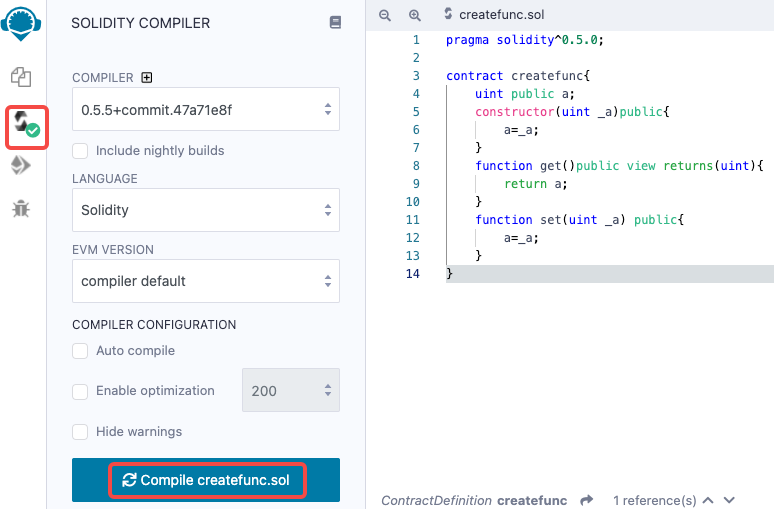
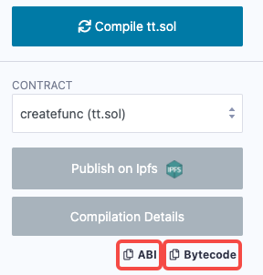

# 合约编译

## 使用Remix方式

打开已经写好.sol文件 -\> 选择左边栏Solidity Compiler -\> 点击按钮Compile XXX.sol（或者在合约编辑框按快捷键 command+s 也可以自动编译合约）



编译好之后，在左边栏可以点击复制ABI和合约bin文件的内容（可用于用vcl部署合约，若使用Remix部署合约则无需复制ABI和Bytecode）：



注意，Bytecode按钮生成的内容如下：

``` json
{
   "linkReferences": {},
   "object": "608060405234801561001057600080fd5b5060405161014c38038061014c8339818101604052602081101561003357600080fd5b8101908080519060200190929190505050806000819055505060f28061005a6000396000f3fe6080604052348015600f57600080fd5b5060043610603c5760003560e01c80630dbe671f14604157806360fe47b114605d5780636d4ce63c146088575b600080fd5b604760a4565b6040518082815260200191505060405180910390f35b608660048036036020811015607157600080fd5b810190808035906020019092919050505060aa565b005b608e60b4565b6040518082815260200191505060405180910390f35b60005481565b8060008190555050565b6000805490509056fea265627a7a72315820b99b06bcae6f6c401f41115127a13e3f1594486cd0da9ca51aaabd75cfa6e98964736f6c63430005110032",
   "opcodes": "PUSH1 0x80 PUSH1 0x40 MSTORE CALLVALUE DUP1 ISZERO PUSH2 0x10 JUMPI PUSH1 0x0 DUP1 REVERT JUMPDEST POP PUSH1 0x40 MLOAD PUSH2 0x14C CODESIZE SUB DUP1 PUSH2 0x14C DUP4 CODECOPY DUP2 DUP2 ADD PUSH1 0x40 MSTORE PUSH1 0x20 DUP2 LT ISZERO PUSH2 0x33 JUMPI PUSH1 0x0 DUP1 REVERT JUMPDEST DUP2 ADD SWAP1 DUP1 DUP1 MLOAD SWAP1 PUSH1 0x20 ADD SWAP1 SWAP3 SWAP2 SWAP1 POP POP POP DUP1 PUSH1 0x0 DUP2 SWAP1 SSTORE POP POP PUSH1 0xF2 DUP1 PUSH2 0x5A PUSH1 0x0 CODECOPY PUSH1 0x0 RETURN INVALID PUSH1 0x80 PUSH1 0x40 MSTORE CALLVALUE DUP1 ISZERO PUSH1 0xF JUMPI PUSH1 0x0 DUP1 REVERT JUMPDEST POP PUSH1 0x4 CALLDATASIZE LT PUSH1 0x3C JUMPI PUSH1 0x0 CALLDATALOAD PUSH1 0xE0 SHR DUP1 PUSH4 0xDBE671F EQ PUSH1 0x41 JUMPI DUP1 PUSH4 0x60FE47B1 EQ PUSH1 0x5D JUMPI DUP1 PUSH4 0x6D4CE63C EQ PUSH1 0x88 JUMPI JUMPDEST PUSH1 0x0 DUP1 REVERT JUMPDEST PUSH1 0x47 PUSH1 0xA4 JUMP JUMPDEST PUSH1 0x40 MLOAD DUP1 DUP3 DUP2 MSTORE PUSH1 0x20 ADD SWAP2 POP POP PUSH1 0x40 MLOAD DUP1 SWAP2 SUB SWAP1 RETURN JUMPDEST PUSH1 0x86 PUSH1 0x4 DUP1 CALLDATASIZE SUB PUSH1 0x20 DUP2 LT ISZERO PUSH1 0x71 JUMPI PUSH1 0x0 DUP1 REVERT JUMPDEST DUP2 ADD SWAP1 DUP1 DUP1 CALLDATALOAD SWAP1 PUSH1 0x20 ADD SWAP1 SWAP3 SWAP2 SWAP1 POP POP POP PUSH1 0xAA JUMP JUMPDEST STOP JUMPDEST PUSH1 0x8E PUSH1 0xB4 JUMP JUMPDEST PUSH1 0x40 MLOAD DUP1 DUP3 DUP2 MSTORE PUSH1 0x20 ADD SWAP2 POP POP PUSH1 0x40 MLOAD DUP1 SWAP2 SUB SWAP1 RETURN JUMPDEST PUSH1 0x0 SLOAD DUP2 JUMP JUMPDEST DUP1 PUSH1 0x0 DUP2 SWAP1 SSTORE POP POP JUMP JUMPDEST PUSH1 0x0 DUP1 SLOAD SWAP1 POP SWAP1 JUMP INVALID LOG2 PUSH6 0x627A7A723158 KECCAK256 0xB9 SWAP12 MOD 0xBC 0xAE PUSH16 0x6C401F41115127A13E3F1594486CD0DA SWAP13 0xA5 BYTE 0xAA 0xBD PUSH22 0xCFA6E98964736F6C6343000511003200000000000000 ",
   "sourceMap": "24:216:0:-;;;68:47;8:9:-1;5:2;;;30:1;27;20:12;5:2;68:47:0;;;;;;;;;;;;;;;13:2:-1;8:3;5:11;2:2;;;29:1;26;19:12;2:2;68:47:0;;;;;;;;;;;;;;;;106:2;104:1;:4;;;;68:47;24:216;;;;;;"
}
```

在生成bin文件时，只需要复制"object"项的值，bin文件内容形如：

``` console
608060405234801561001057600080fd5b5060405161014c38038061014c8339818101604052602081101561003357600080fd5b8101908080519060200190929190505050806000819055505060f28061005a6000396000f3fe6080604052348015600f57600080fd5b5060043610603c5760003560e01c80630dbe671f14604157806360fe47b114605d5780636d4ce63c146088575b600080fd5b604760a4565b6040518082815260200191505060405180910390f35b608660048036036020811015607157600080fd5b810190808035906020019092919050505060aa565b005b608e60b4565b6040518082815260200191505060405180910390f35b60005481565b8060008190555050565b6000805490509056fea265627a7a72315820b99b06bcae6f6c401f41115127a13e3f1594486cd0da9ca51aaabd75cfa6e98964736f6c63430005110032
```

## 使用vcl方式

在前面章节已经介绍了如何安装solidity的命令行编译器solc。该编译器可以生成各种输出，范围从简单的二进制文件、汇编文件到用于估计 `gas` 使用情况的抽象语法树（解析树）。

使用如下命令来查看它的所有选项的解释：

``` bash
solc --help
```

使用如下命令可以在 `Storage_output` 文件夹中生成二进制bin文件和abi文件：

``` bash
solc --bin --abi -o Storage_output Storage.sol
```

## 使用truffle方式

如果使用 [**安装方式一：直接安装**](evm_contract_develop_install_1) 安装truffle的，那么

``` bash
# 在合约项目的根目录下执行
truffle compile
```

如果使用 [**安装方式二：源码编译**](evm_contract_develop_install_2) 安装truffle的，那么

``` bash
# 在合约项目的根目录下执行
yarn run truffle compile  
```
