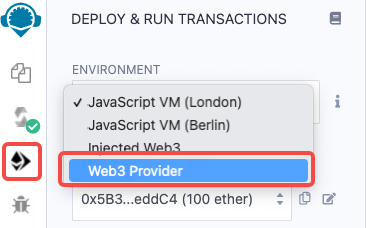
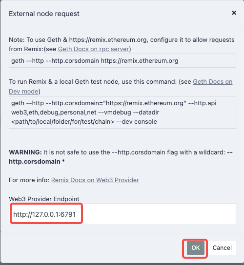
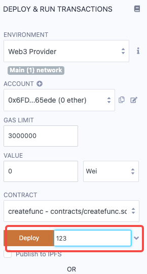
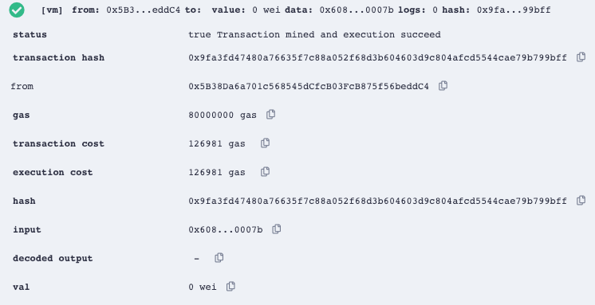
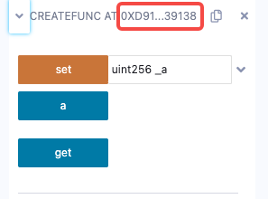
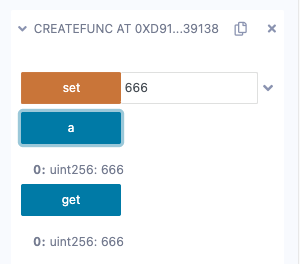

# 合约部署与调用

```{note}
如果是在Venachain项目目录下编译后进行操作的，那么 `${WORKSPACE}` 为 `Venachain/release/linux` 。如果是下载release包进行部署的，那么 `${WORKSPACE}` 为 `linux` 。
```

## 使用Remix方式

### 合约部署

选择左边栏Deploy & run transactions -\> 选择ENVIRONMENT



选择Web3 Provider后会弹出如下提示框，需要在Web3 Provider EndPoint中填入Venachain节点的IP和RPC端口号。点击OK确认。



点击Deploy进入部署，如果合约带构造函数，且构造函数带有参数，则需要填写参数值；反之则不需要填写参数值，直接点击Deploy即可：



之后Remix便将合约部署在前面设定的Venachain的节点上，页面会在右下角的框中给出合约部署的相关信息，如下所示。



左边框会显示智能合约地址：



也可以根据交易哈希，可以在链上查询智能合约地址：

``` console
> eth.getTransactionReceipt("0xf488e0a6ed05c5916ffc1f9cf229b4d7a6bd8ca3956e3129231a1b05c0e223c8") 

{ 
   blockHash: "0x2f6276288a4c80cc502f25a8344c7b15f50b2ab2070f68758821a867d89232e4", 
   blockNumber: 9, 
   contractAddress: "0x034265dabe530aa58df4a2f9112c76947901f4a6", cumulativeGasUsed: 71817, 
   from: "0xc2ac9fa3887490767d03aa106c6d14a7507fa463", 
   gasUsed: 71817, 
   logs: [], 
   logsBloom: "0x00000000000000000000000000000000000000000000000000000000000000000000000000000000000000000000000000000000000000000000000000000000000000000000000000000000000000000000000000000000000000000000000000000000000000000000000000000000000000000000000000000000000000000000000000000000000000000000000000000000000000000000000000000000000000000000000000000000000000000000000000000000000000000000000000000000000000000000000000000000000000000000000000000000000000000000000000000000000000000000000000000000000000000000000000000000", 
   status: "0x1", 
   to: null, 
   transactionHash: "0xf488e0a6ed05c5916ffc1f9cf229b4d7a6bd8ca3956e3129231a1b05c0e223c8",
   transactionIndex: 0
}
```

### 合约调用

通过界面右下方可视化界面即可进行函数调用操作：



## 使用vcl方式

### 部署合约

``` bash
./vcl contract deploy ../../../cmd/vcl/test/test_case/sol/storage_byzantium_065.bin --abi ../../../cmd/vcl/test/test_case/sol/storage_byzantium_065.abi --keyfile ../conf/keyfile.json -vm evm
```

如果合约有构造函数，且构造函数有参数，则使用 `--param` 标签携带参数，如果有多个参数，则形如 `--param "xxx" --param "yyy"` 。例如：

``` bash
./vcl contract deploy Storage_output.bin --abi Storage_output.abi --keyfile ../conf/keyfile.json -vm evm --param "123"
```

会提示输入密码，默认密码为0。输入密码后结果如下：

``` console
Passphrase: 
{   
   "blockHash": "0x66d19fb27341ac21c42404aa944204015abec69e9fdbc2d931dbb6a12be09284",   
   "blockNumber": "0x6",   
   "contractAddress": "0x4ba7169041ca383ac19b5496eaf94ce00c464658",   
   "cumulativeGasUsed": "0x12c41",   
   "from": "0xc2ac9fa3887490767d03aa106c6d14a7507fa463",   
   "gasUsed": "0x12c41",   
   "root": "",   
   "to": "",   
   "transactionHash": "0x1ab1bce53dc54b9f63996139f987d71d1169610938ab261002fa36425346cc7f", 
   "transactionIndex": "0x0",   
   "logs": [],   
   "status": "0x1" 
}
result:{   
   "status": "Operation Succeeded",   
   "contractAddress": "0x4ba7169041ca383ac19b5496eaf94ce00c464658", 
   "blockNumber": 6,   
   "GasUsed": 76865,   
   "From": "0xc2ac9fa3887490767d03aa106c6d14a7507fa463",   
   "To": "",   
   "TxHash": "" 
}
```

为确定合约部署成功，可以在console界面进行查询，交易状态为0x1即为成功。

``` console
> eth.getTransactionReceipt("0x1ab1bce53dc54b9f63996139f987d71d1169610938ab261002fa36425346cc7f") 

{   
   blockHash: "0x66d19fb27341ac21c42404aa944204015abec69e9fdbc2d931dbb6a12be09284",  
   blockNumber: 6,   
   contractAddress: "0x4ba7169041ca383ac19b5496eaf94ce00c464658",
   cumulativeGasUsed: 76865,   
   from: "0xc2ac9fa3887490767d03aa106c6d14a7507fa463",   
   gasUsed: 76865,   
   logs: [],   
   logsBloom: "0x00000000000000000000000000000000000000000000000000000000000000000000000000000000000000000000000000000000000000000000000000000000000000000000000000000000000000000000000000000000000000000000000000000000000000000000000000000000000000000000000000000000000000000000000000000000000000000000000000000000000000000000000000000000000000000000000000000000000000000000000000000000000000000000000000000000000000000000000000000000000000000000000000000000000000000000000000000000000000000000000000000000000000000000000000000000",   
   status: "0x1",   
   to: null,   
   transactionHash: "0x1ab1bce53dc54b9f63996139f987d71d1169610938ab261002fa36425346cc7f",   
   transactionIndex: 0 
}
```

(evm_contract_deploy_vcl)=
### 调用合约

调用store方法：

``` bash
./vcl contract execute "0x4ba7169041ca383ac19b5496eaf94ce00c464658" "store" --param 123 --abi ../../../cmd/vcl/test/test_case/sol/storage_byzantium_065.abi --vm evm --keyfile ../conf/keyfile.json
```

输入密码后结果如下：

``` console
Passphrase: 
{   
   "blockHash": "0x70e2077d9c4fc5bc46f0ca1e97b84194e8506c3ec6c96c96eb30ec21386dc2a6",   
   "blockNumber": "0x8",   
   "contractAddress": "",   
   "cumulativeGasUsed": "0xa3e6",   
   "from": "0xc2ac9fa3887490767d03aa106c6d14a7507fa463",   
   "gasUsed": "0xa3e6",   
   "root": "",   
   "to": "0x4ba7169041ca383ac19b5496eaf94ce00c464658",   
   "transactionHash": "0x30fb05fa917ef635b93e73b51dddf40c7a95ac1f10862175c552223119186e8a",   
   "transactionIndex": "0x0",   
   "logs": [],   
   "status": "0x1" 
} 
result0: 
{   
   "status": "Operation Succeeded",   
   "blockNumber": 8,   
   "GasUsed": 41958,   
   "From": "0xc2ac9fa3887490767d03aa106c6d14a7507fa463",   
   "To": "0x4ba7169041ca383ac19b5496eaf94ce00c464658",   
   "TxHash": "" 
}
```

调用retrieve方法，检验store方法设置的值是否生效：

``` bash
./vcl contract execute "0x4ba7169041ca383ac19b5496eaf94ce00c464658" "retreive" --abi ../../../cmd/vcl/test/test_case/sol/storage_byzantium_065.abi --vm evm --keyfile ../conf/keyfile.json
```

结果：

``` console
Passphrase: 
result0:
   123
```

## 使用truffle方式

### 合约部署

修改合约项目的根目录下的 `truffle_config.js` 文件。

例如，若

-   设置network的名称为venachain
-   根据venachain节点的ip和rpc端口号填写host、port
-   from填写venachain的链上账号地址（常见问题见 [**Q&A**](evm_contract_deploy_qa)）
-   network_id填默认值1

则 `truffle_config.js` 文件修改如下：

``` javascript
module.exports = {
// Uncommenting the defaults below 
// provides for an easier quick-start with Ganache.
// You can also follow this format for other networks;
// see <http://truffleframework.com/docs/advanced/configuration>
// for more details on how to specify configuration options!
//
networks: {
   venachain: {
      host: "127.0.0.1",
      port: 6791,
      from: "0xfA46a3570c7ED0239B414d11bA506cb404F254CE",
      network_id: 1
   }
},
```

如果使用 [**安装方式一：直接安装**](evm_contract_develop_install_1) 安装truffle的，那么在合约根目录下执行：

``` bash
# 其中，--network后面的参数，与truffle_config.js中定义的 network 名称保持一致。
truffle migrate --network venachain --reset
```

如果使用 [**安装方式二：源码编译**](evm_contract_develop_install_2) 安装truffle的，那么在合约根目录下执行：

``` bash
# 其中，--network后面的参数，与truffle_config.js中定义的 network 名称保持一致。
yarn run truffle migrate --network venachain --reset
```

### 合约调用

可使用vcl调用合约（[**详见上文**](evm_contract_deploy_vcl)）或进入truffle console进行合约调用。下面具体介绍如何通过truffle console进行合约调用。

如果使用 [**安装方式一：直接安装**](evm_contract_develop_install_1) 安装truffle的，那么在合约根目录下执行如下命令进入truffle console控制台：

``` bash
# --network后面的参数，与truffle_config.js中定义的 network 名称保持一致。
truffle console --network venachain
```

如果使用 [**安装方式二：源码编译**](evm_contract_develop_install_2) 安装truffle的，那么在合约根目录下执行如下命令进入truffle console控制台：

``` bash
# --network后面的参数，与truffle_config.js中定义的 network 名称保持一致。
yarn run truffle console --network venachain
```

调用合约指令详见 <https://trufflesuite.com/docs/truffle/getting-started/interacting-with-your-contracts.html> 。

(evm_contract_deploy_qa)=
### Q&A

**1. 执行truffle migrate 命令部署合约时报错： \"Migrations\" \-- sender account not recognized.**

**解决方法**：检查合约项目根目录下 `truffle_config.js` 文件中的 `from` 字段填写的地址是否为链上账户地址。

**链上地址查询方式**：在链项目的 `${WORKSPACE}/scripts` 目录下执行如下命令进入console界面：

``` bash
./venachainctl.sh console -n 0
```

然后执行如下查询命令即可：

``` bash
> eth.accounts
```

**2. 执行truffle migrate 命令部署合约时报错： \"Migrations\" could not deploy due to insufficient funds.**

**解决方法**：检查合约项目根目录下 `truffle_config.js` 文件中的 `from` 字段填写的地址是否有余额。

例如，可填写venachain的 `node.address` ，该地址默认有gas费，但使用前需解锁账号，解锁方法如下：

在链项目的 `${WORKSPACE}/bin` 目录下执行:

``` bash
## 设置密码为：0
./venakey generate --privatekey ../data/node-0/node.prikey
```

上述命令会在当前目录下生成一个 `keyfile.json` 文件。将该文件移动到链项目的 `${WORKSPACE}/data/node-0/keystore` 目录下：

``` bash
mv keyfile.json ../data/node-0/keystore
```

在链项目的 `${WORKSPACE}/scripts` 目录下执行:

``` bash
./venachainctl.sh console -n 0
```

继续执行：

``` bash
> eth.accounts
```

结果：

``` console
["0xedeaac8375b90ef4f298c18271baa9b27d5cde20", "0xfa46a3570c7ed0239b414d11ba506cb404f254ce"]
```

继续执行解锁操作（下标从0开始，如果查到的 `node.address` 是上述结果中的第二个，那么解锁账户的下标为1）：

``` bash
> personal.unlockAccount(eth.accounts[1])
```

将 `node.address` 填入合约项目根目录下 `truffle_config.js` 文件中的 `from` 字段即可。
