# Graces 使用

##  1.打开网站

输入[http://localhost:8080/](http://localhost:8080/)


## 2.添加链

1. 启动对应的链

2. 点击右上角的添加链

    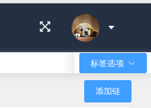


3. 输入对应的信息

    

4. 可以看到链已经成功添加

    

    ```{note}
    ​  第一次添加还需要点击 `全量同步` 。
    ```

5. 可从侧边栏里选择相应的功能进行浏览
 
  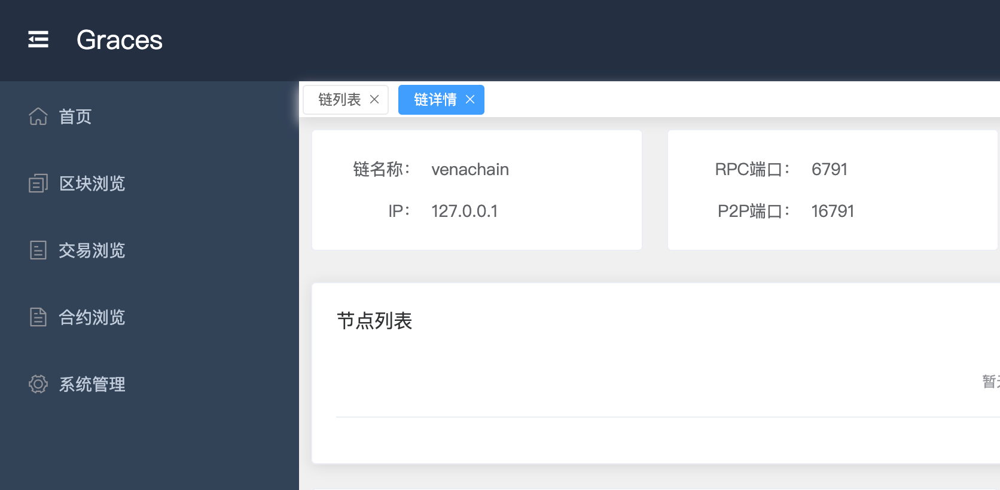

## 3.使用链

- 点击链的名称进入到该链中

  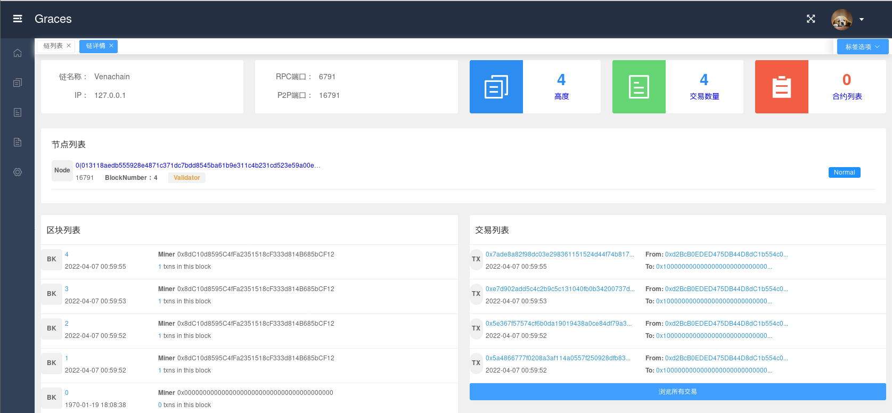

### 区块浏览

- 点击菜单栏的第二个 `区块浏览`

  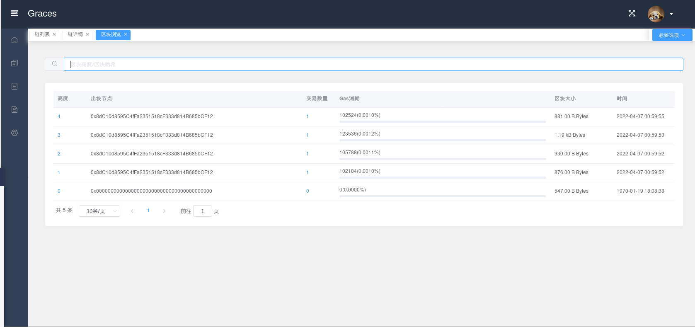

  可以看到区块的高度，出块节点，交易数量等信息。您也可以搜索您想要的区块高度。

### 交易浏览

- 点击菜单栏的第三个 `交易浏览`

  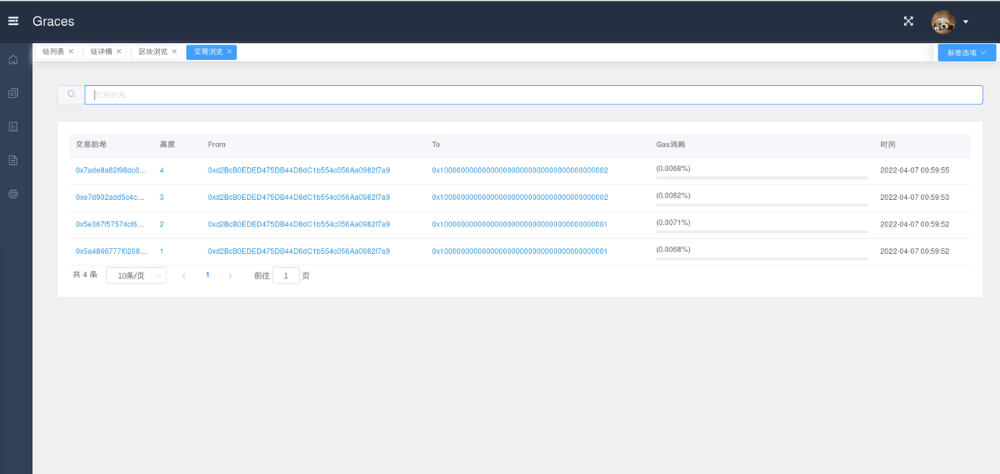

  可以看到交易哈希，高度，交易的账户地址等信息。您也可以搜索您想要的交易哈希。

- 点击交易哈希可以查看这笔交易的交易详情

  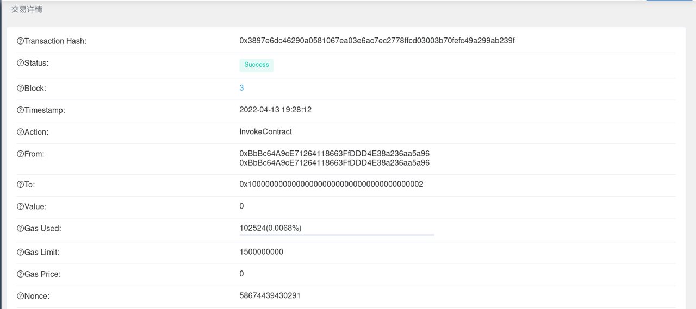

  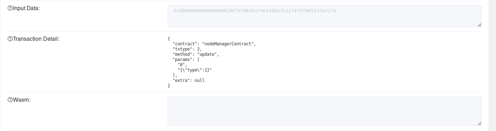
  
  交易详情包括：交易哈希、交易执行状态、区块高度、时间戳、执行目的等

### 合约浏览

- 点击菜单栏的第四个 `合约浏览`

  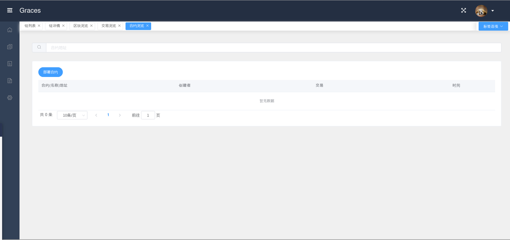

- 点击左上角的 `部署合约`

  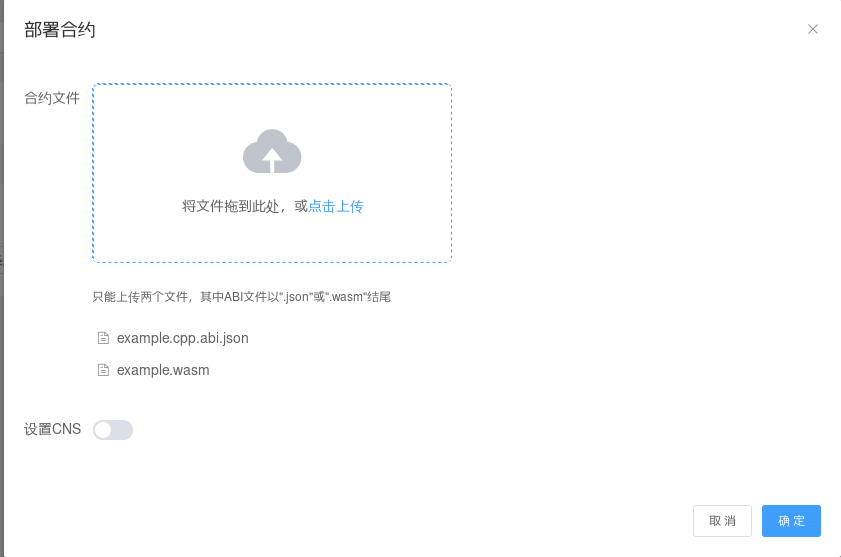

  ```{note}
  您可以上传您的合约文件（只能上传两个文件）和设置CNS。
  ```

- 部署成功

  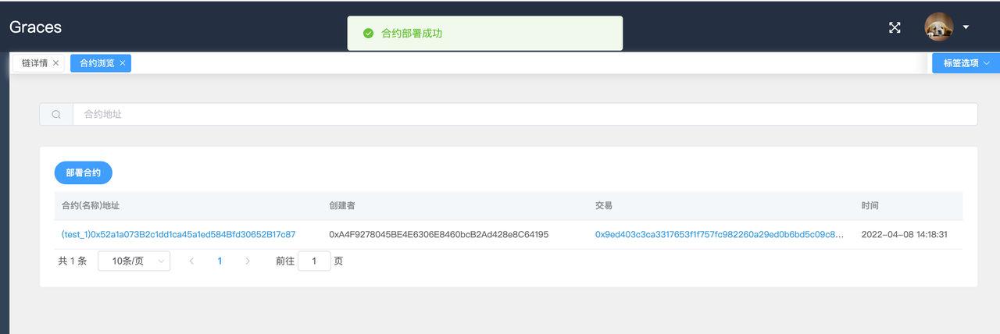

### 系统管理

点击菜单栏的第五个 `系统管理`

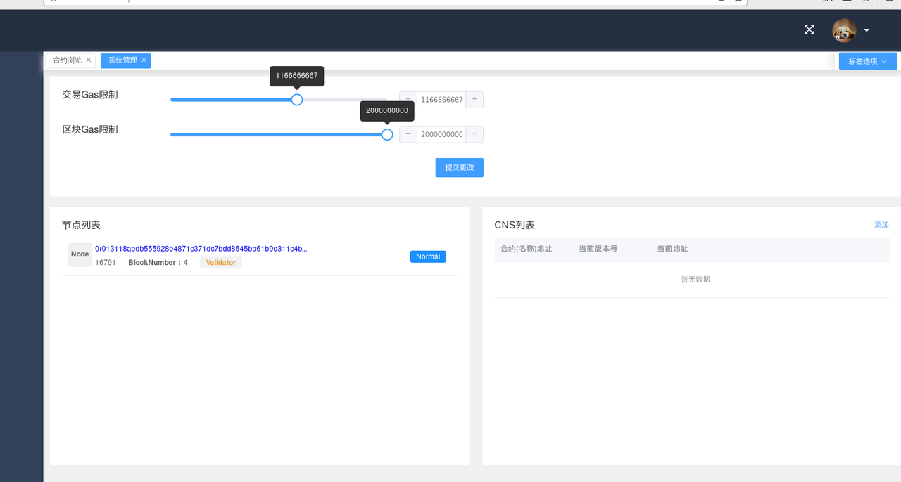

在这里您可以设置交易Gas限制以及区块Gas限制，提交更改后方可生效。您可以看到链上的节点列表以及CNS列表

```{warning}
不要轻易修改链上的配置参数
```