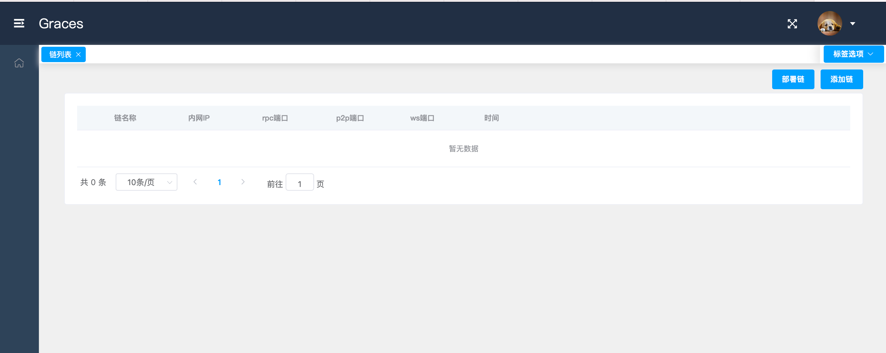

# Graces 安装

## 环境准备

### 硬件环境准备

- 主  机：Intel Xeon E5-2650或以上。

- 内  存：16G或以上。

- 硬  盘：32GB或以上。

- 图形卡：VGA/DVI。

### 软件环境准备

- OS	Linux 64bit
- Golang 1.14.4 或以上
- Venachain v1.0.0 或以上
- MongoDB 4.2.8 或以上
- npm 6.14.13 或以上
- nodjs v14.17.1 或以上
- Graces v1.0.0

## 安装步骤

### 1. 下载、安装和配置 Golang

### 2. 下载、安装和启动 MongoDB
   
### 3. 下载和编译 Venachain

Venachain仓库地址：[https://git-c.i.wxblockchain.com/vena/src/venachain](https://git-c.i.wxblockchain.com/vena/src/venachain)

安装方法请参考：[安装文档](../../../区块链部署/Venachain环境准备与编译.md)

### 4. 下载 Graces V1.0.0 

- 下载 Graces 后端源码：

   下载地址：[https://git-c.i.wxblockchain.com/vena/src/graces/graces-server/-/tags/v1.0.0](https://git-c.i.wxblockchain.com/vena/src/graces/graces-server/-/tags/v1.0.0)

      重命名：

      ```sh
      mv graces-server-v1.0.0.zip ./graces-server.zip
      ```

- 下载 Graces 前端源码：

   下载地址：[https://git-c.i.wxblockchain.com/vena/src/graces/graces-web/-/tags/v1.0.0](https://git-c.i.wxblockchain.com/vena/src/graces/graces-web/-/tags/v1.0.0)

   重命名：

   ```sh
   mv graces-web-v1.0.0.zip ./graces-web.zip
   ```

- 下载完成后对项目文件进行解压。

   ```sh
   unzip graces-server.zip
   unzip graces-web.zip
   ```

   

### 5. 配置 MongoDB

MongoDB 启动成功后，需要为 graces 创建数据库和用户。

1. 先用自己设置好的账号密码登录 MongoDB。

2. 使用下面命令创建 graces 数据库，并进入 graces 数据库。

   ```shell
   use graces;
   ```

3. 使用下面命令在 graces 数据库下创建 test 用户并赋予读写和管理角色。
   
   ```shell
   db.createUser(
      {
      user: "test",
      pwd: "test",
      roles: [ "readWrite", "dbAdmin" ]
      }
   );
   ```   

   完成上述步骤，我们就可以在 graces-server 中使用 test 用户去操作 MongoDB 的 graces 数据库了。

   ```{note}
   test 只是一个示例用户，您可以换成自己想要创建的用户和密码。
   ```


### 6. 配置 Graces 前端

进到 graces-web 目录下，修改 `.env.development` 文件中 base api 下的 `localhost:9999` 为 `graces-server` 所在机器的 IP 端口号或域名端口号，如果不修改则默认使用 `localhost:9999` 。

```
# base api
VUE_APP_BASE_API = 'http://localhost:9999/api'
VUE_APP_BASE_WS = 'ws://localhost:9999/api'
```

### 7. 配置 Graces 后端

1. 进到 graces-server 目录下。

2. 在 `go.mod` 文件中配置好对 Venachain 的依赖，修改为自己下载好且编译好后的 Venachain 路径

   ```
   replace (
         github.com/Venachain/Venachain => /你的路径/Venachain-1.0.0
   )
   ```

3. 在 `config.toml` 文件中配置 graces-server 运行的 IP 地址和端口号。需要注意的是，cors 的值必须是 graces-web 的运行地址，本示例前端运行在 [http://localhost:8080](http://localhost:8080) 中。

   ```toml
   [http]
   ip = "127.0.0.1"
   port = "9999"
   # mode 必须是 "release"、"debug"、"test" 中的一个
   mode = "debug"
   # cors 跨域资源共享白名单
   cors = "http://localhost:8080"
   ```

4. 在 config.toml 文件中配置 graces-server 所需的 MongoDB 信息，其中 username 和 password 应该填写为上面我们已经在 MongoDB 中配置好的 graces 数据库的用户和密码。

   ```toml
   [db]
   ip = "127.0.0.1"
   port = "27017"
   username = "test"
   password = "test"
   dbname = "graces"
   timeout = 10
   ```

### 8. 启动 Graces

   1. 启动 Graces 后端

      进到 graces-server 目录下，执行以下命令

      ```sh
      go build -o graces
      nohup ./graces > ./graces.log 2>&1 &
      ```

   2. 启动 Graces 前端

      进到 graces-web 目录下，执行以下命令

      ```sh
      npm install
      npm run dev
      ```

### 9. 访问 Graces

开打浏览器，输入 [http://localhost:8080](http://localhost:8080) 便可以进到 Graces 主页面。



## 问题处理

### 1. 关于跨域问题的处理

```{warning}
如果 graces-server 和 graces-web 不是部署在同一机器上，则 graces-web 与 graces-server 的链接可能会出现跨域问题，这时候需要做两步操作:
```

1. 在 graces-web 里面找到 `vue.config.js` 配置文件，在里面修改 `devServer` 中 `sockHost` 的值为 `graces-web` 的ip地址和端口号，整体内容如下：

   ```js
   module.exports = {
      publicPath: '/',
      assetsDir: 'static',
      productionSourceMap: false,
      configureWebpack: {
            devtool: 'source-map'
      },
      devServer:{
            sockHost: 'graces-web 的ip地址:端口号',
            disableHostCheck: true,
      }
   }
   ```

   `.env.development` 文件里面的`localhost:9999` 也要改为 `graces-server` 所在机器的 IP 端口号。
      
   ```
   # base api
   VUE_APP_BASE_API = 'http://graces-server的ip:端口/api'
   VUE_APP_BASE_WS = 'ws://graces-server的ip:端口/api'
   ```
   
2. 在 `graces-server` 里面找到 `config.toml` 配置文件，修改 ip 的值为 `graces-server` 所在机器的公网 ip，修改 cors 的值为 `graces-web` 的访问地址，如下：
   
   ```toml
   [http]
   ip = "graces-server 的公网ip"
   port = "9999"
   # mode 必须是 "release"、"debug"、"test" 中的一个
   mode = "debug"
   # cors 跨域资源共享白名单，这是 graces-web 的访问地址，如：http://localhost:8080
   cors = "graces-web 的访问地址"
   ```
   
### 2. graces-server 编译报错
    
如果在编译 graces-server 时出错，可能是由于缺少依赖包导致的，执行一下以下命令再尝试：
    
```shell
go mod tidy
```
   
### 3. mongodb 链接失败
    
如果在启动 graces-server 过程中出现以下错误，则需要确认一下 graces-server 连接 mongodb 的账号密码配置是否正确。
    
```shell
FATA[0000] failed to connection DB： connection() error occured during connection handshake: auth error: sasl conversation error: unable to authenticate using mechanism "SCRAM-SHA-1": (AuthenticationFailed) Authentication failed.
```