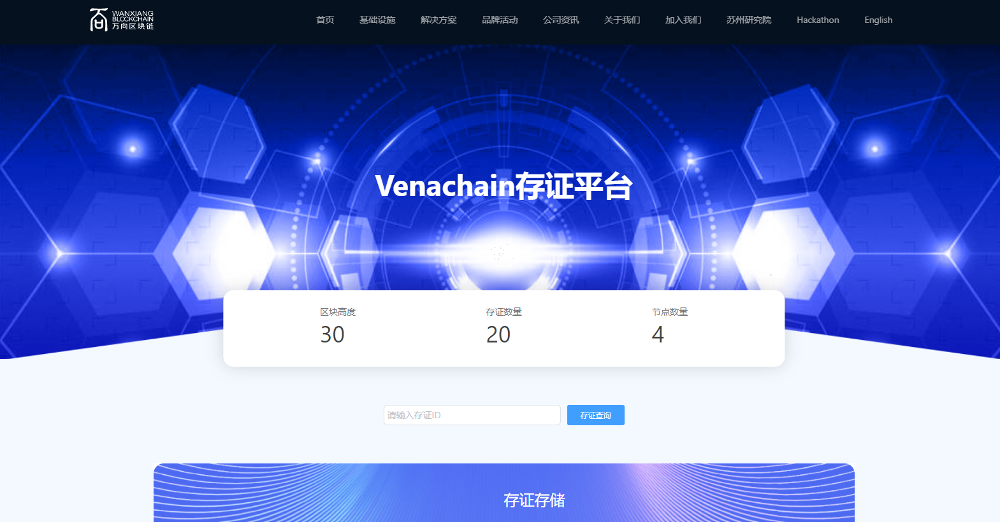
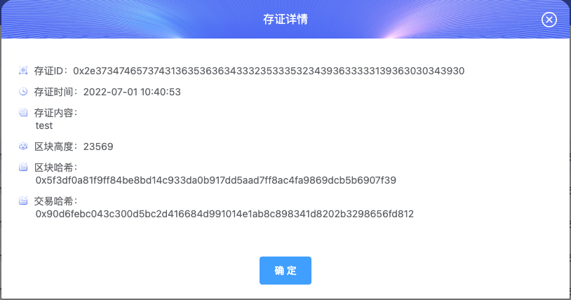
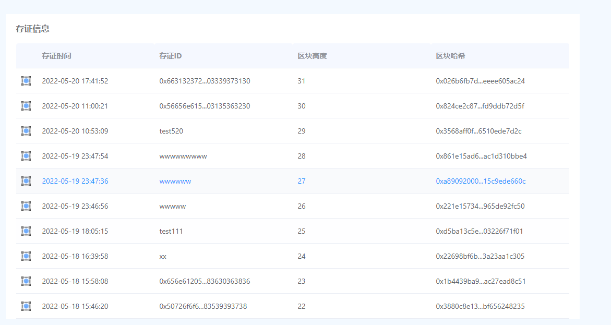

# VenaProof 使用

| **时间**   | **修改人** | **修改事项** | **存证平台版本** | **文档版本** |
| ---------- | ---------- | ------------ | ---------------- | ------------ |
| 2022.05.20 | 陈赛       | 初稿         | 0.0.1            | 1.0          |

## 1.进入存证平台

## 2.存证统计信息

- 区块高度、区块数量、节点数量

 

## 3.存证查询

- 输入存证ID进行查询详情

- 详情弹窗展示

## 4.存证存储

- 输入存证ID（不输入字段生成）；存储内容

## 5.存证列表

- 最新10条存证信息（存证时间，存证ID，区块高度，区块哈希）
- 点击每一行可显示当行存证详细信息

