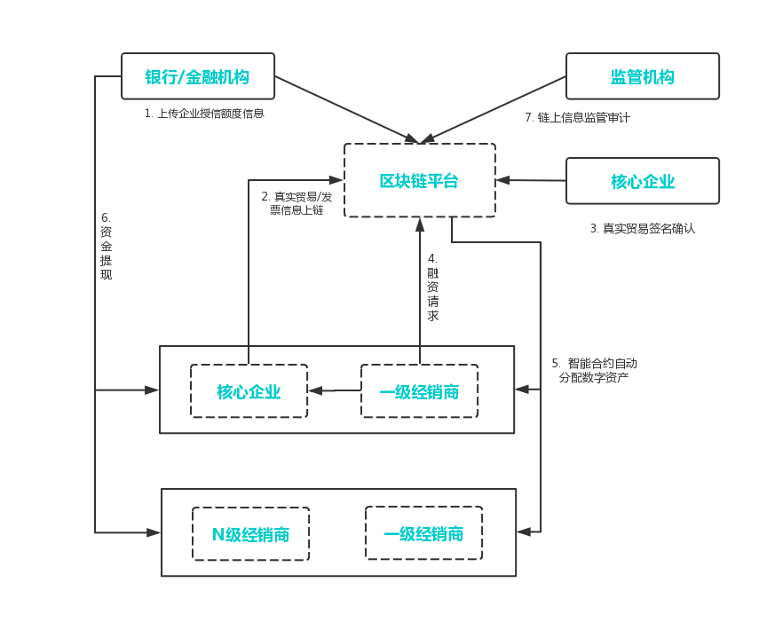

==========
供应链金融
==========

可为供应链上下游企业构建一个信息对称共享、核心企业信用价值可传递、商票可拆分流程、风险可控的新型供应链金融融资模式，并为监管提供数据追溯便利，提升行业整体服务效率。

1.1. 传统供应链金融的痛点
=========================

（1）监管难以穿透

供应链层级的繁复，使贸易真实性和交易透明性无法简单通过系统进行确认和审核，造成了监管的不便利性。

（2）商票不可拆分、流转

传统的商票不可拆分，供应商无法基于商票再次背书转让，核心企业信用无法有效传递给多级供应商体系。

（3）金融机构风险敞口较大

供应商、经销商之间的约定或合同信息无法得到有效确认或核实，使得金融机构存在较大的授信风险。

（4）核心企业信用无法传递

在传统供应链金融多级供应商体系下，信息难以有效传递，使得一级供应商以外的其他层级供应商无法享受到核心企业的信用，融资较难。

基于区块链技术和密码学算法，PlatONE为供应链金融提供了资产可数字化确认、处理、流转的平台解决方案，主要功能模块有：

（1）资产登记

企业债权可通过区块链进行登记存储，形成不可篡改的数据记录，实现各参与机构间的信息实时共享。

（2）资产确权

通过相关参与方的确认，由智能合约自动将应收账款和核心企业信用转化成数字资产并登记到相应账户，实现资产的确权。

（3）资产数字化

以链上确权数据信息为基础，通过智能合约自动为企业建立可在区块链联盟间进行交易和流转的数字资产。

（4）数字资产管理

支持不同属性资产的统一管理和查询，通过预设的智能合约实现链上资产的的自动化分配、拆分、流转和注销。

（5）监管审计

提供监管审计入口，赋予监管机构审计权限，可查看平台上所有资产的交易。

（6）多层级隐私保护

运用广播加密、同态加密、零知识证明等加密算法保护供应链金融各参与方的数据安全和隐私保护。

1.2. 适用场景
=============

（1）授信融资

金融机构对客户授予信用额度，在这个额度内客户向银行借款可减少繁琐的贷款检查。

（2）应收款融资

企业以自己的应收账款转让给银行并申请贷款。

（3）票据融资

将商业票据转让给银行，银行按票面金额扣除贴现利息后将余额支付给收款人。

PlatONE已被用于打造国内首款基于区块链技术，专注于汽车供应链，服务于汽车产业核心企业的金融产品。产品提供供应链应收货款融资的高效解决方案，解决了多方信任的问题，在保障数据安全的条件下解决数据主权问题。另外，PlatONE还被业内高科技公司和银行共同打造成基于区块链供应链金融平台，平台活跃用户已达56家，融资额累计至数千万。

