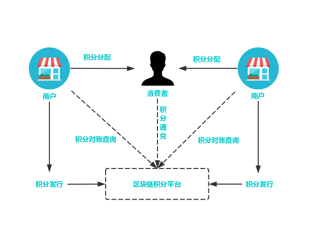

========
积分管理
========

基于Venachain可实施一站式积分管理平台，引入积分发行方、商户、消费者。将积分的发行、流通、消费等行为审计上链。

现有积分体系的痛点
=======================

1）积分使用不便

单一企业的积分存在使用限制和兑换局限，难以提升消费者积分使用积极性，无法形成积分奖励策略的良性循环。

2）积分难以流通

缺少便捷的异业通兑渠道，跨行业或机构的积分结算较复杂，难以形成广泛的积分转让、赠送、跨平台使用渠道。

3）系统建设成本高

自建积分系统成本高，涉及合作伙伴间的积分兑换，则需要系统对接并设置兑换比例，增加了管理和维护成本。

**方案详情**

基于Venachain打造的积分通兑互换平台，可支持不同企业以合约的方式快速进行积分的发行、兑换比例设置和交易结算。

1） 积分发行

积分发行商可通过平台自主维护积分发行数量，设定积分奖励比率。

2）积分兑换

通过智能合约维护积分兑换比例，实现消费者消费时积分的自动增减。

3）积分通兑

通过上层合约，可实现跨机构间的积分使用，并按照各企业设置的积分兑换比例，快速完成积分转换和账务核对。

4）积分查询

积分参与方或消费者可在链上实时查询积分奖励和交易记录。

5）积分对账

根据积分链上流转记录，支持积分发行商与商家、积分发行商之间的自动对账。

适用场景
=============

1）积分商城

用户可凭积分兑换物品或服务。

2）员工福利

企业可用积分激励或奖励员工，员工可使用积分兑换福利。

3）会员积分

商户给消费者发放的会员卡（或账户）进行积分，积分一般限于当地或者发卡商户使用。

4）异业积分通兑互换

跨行业积分联盟之间积分互兑，例如：航空积分兑换酒店住宿。

