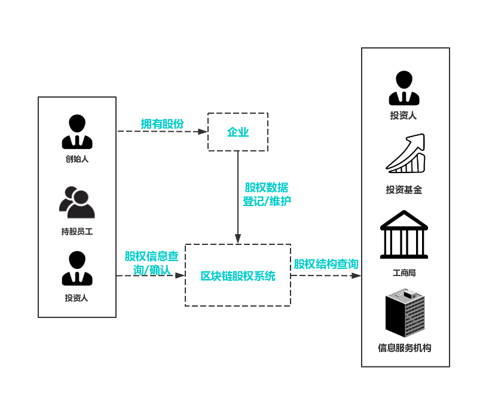

========
股权登记
========

基于PlatONE可实现企业股权信息的及时登记确认与维护，通过分布式架构降低机构对接门槛，实现股权数据的实时安全共享，保证重要信息披露的准确性和透明性，为企业提供更为便利和高效的金融服务支持。

传统股权登记流程的痛点
===========================

1）信息同步滞后

依托工商局的股权登记，具有滞后性，股权的变更信息不能实时同步，不利于潜在投资者查看公司真实股权信息。

2）股权所属权维护关系薄弱

企业频繁的股权变更，会给股东名册的维护增加困难，不利于历史交易的维护和跟踪。

3）传统方式不便利

纸质材料传递和人工办理的不便利。

方案详情
=============

基于PlatONE构建的股权登记、查询平台，可为企业、股东提供可靠的股权登记、变更及交易模式，并支持与工商、信息服务机构的对接，提升场外股权登记、维护效率和可信度。具体功能模块有：

1）股权信息登记

在链上进行股权信息的登记和存储，区块链的节点共识特性可保证参与方间数据的一致性。区块链完整记录了股权所有权信息和变更记录，确保数据的不可篡改。

2）股东名册维护

企业可将股东名册登记上链，股东可在第一时间获得股东名册的更新信息并通过签名进行确认，以此来确保股东名册的一致性和有效性。

3）股权信息同步

与工商或者服务机构间的信息同步和确认，基于区块链的股权登记平台，可形成企业可追溯、可审计、可靠的企业信息及股权登记变更档案。

适用场景
=============

1）创业公司股权管理

创业公司员工持股、股权激励、预分配等。

2）场外市场股权登记

场外股权托管、挂牌、交易等。

