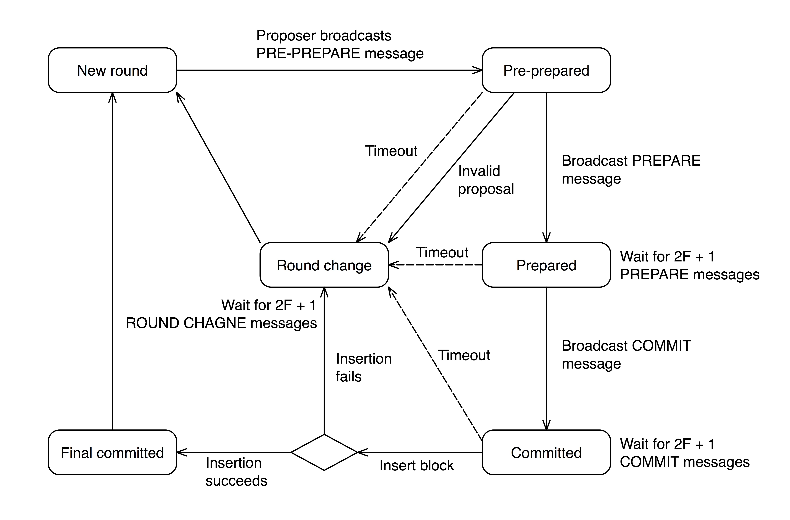

========
共识算法
========

.. _ibft:

1. Istanbul 共识算法
====================

1.1. 概述
^^^^^^^^^

PlatONE
中的共识为高度优化的BFT类共识算法，其容错率为1/3，在保留即时确认（instant
finality）的关键特性的同时,极大地提高了去中心化的程度。共识可以保证上链的区块是确定的，也就是说链不会出现分叉，同时每一个有效的区块都会插入到链上。

PlatONE
的共识支持超过100个共识节点。相对于其他一些常见的BFT共识，PlatONE
的共识的性能有显著的提升。在10个共识节点的情况下，TPS 接近 1000。

PlatONE 的共识运行的相关参数可以灵活地进行配置，并且 PlatONE
的共识中的共识节点集合可以灵活地进行更新。近期计划支持共识的插件化，以及共识的可审计性等。

PlatONE 共识是在 round 上进行的。在特定的 round
上，通过预先设置的策略选取一个出块者节点。出块者节点的选取策略目前支持两种：round
robin 和 sticky proposer。

出块者节点提议区块后，各共识节点进行共识。共识分三阶段，其中后两个阶段为投票阶段，用以保证
Safety。PlatONE 共识使用 round change
机制结合锁定和解锁机制来保证共识的的 liveness
。通过优化解锁机制，解决了业界多个知名项目内存在的共识死锁问题。

PlatONE
共识会为每一个链上的区块生成共识证明，也就是对于该区块的各共识节点的有效签名，因而区块可以进行自验证，同时也能支持轻节点。

区块中如果不包含交易，则称为空区块。PlatONE
目前支持不出空区块，也就是上链的区块中都含有交易。不出空区块的机制可以有效地节省区块链占用的存储空间。

以下具体介绍 PlatONE 中的共识算法。

1.2. 共识节点选取机制
^^^^^^^^^^^^^^^^^^^^^

-  节点的类型和状态

   节点分为共识节点（validator）和观察员节点两种类型。对于共识节点来说，存在两种状态：正常和隔离。只有处于正常状态的共识节点才可以参与共识和打包区块。

-  共识节点的选取机制

   节点管理（NodeManager）系统合约设计用于存储和管理节点信息。可以通过节点申请（NodeRegister）系统合约申请注册共识节点，审核通过后，申请节点的类型会更新为共识节点，更新后的节点信息存储在节点管理合约中，并且可被查询。

   管理员可以根据需要更新共识节点的状态，来决定共识节点是否可以参加共识。

-  共识节点集合的获取

   链上每次产生新区块后，节点管理合约中最新的节点信息都会被读取，并且最新的共识节点集合会被保存下来，并被共识引擎读取和使用。

1.3. 共识流程
^^^^^^^^^^^^^

1.3.1. 正常流程
---------------

1.3.1.1. 定义
>>>>>>>>>>>>>

以下是一些重要术语或概念的定义。

-  ``+2/3`` 表示”超过 2/3”.

-  ``NEW ROUND``: 新的round中会确定一个新的区块提议者（比如采用round
   robin算法），在新的round开始时，各共识节点等待接收\ ``PRE-PREPARE``\ 消息
   
-  ``PRE-PREPARED``: validator节点接收到了\ ``PRE-PREPARE``
   消息，同时广播\ ``PREPARE``\ 消息之后进入这种状态。之后，validator节点等待并接收\ ``+2/3``\ 的\ ``PREPARE``
   或 ``COMMIT``
   消息。（注：有的validator节点因锁定在提议区块上，会在收到\ ``PRE-PREPARE``
   消息后直接广播\ ``COMMIT``
   消息。因此，这里validator节点等待并接收\ ``PREPARE`` 或 ``COMMIT``
   消息）
   
-  ``PREPARED``:
   validator节点接收到了\ ``+2/3``\ 的\ ``PREPARE``\ 消息，同时广播\ ``COMMIT``\ 消息之后进入这种状态。之后，validator节点等待并接收\ ``+2/3``\ 的
   ``COMMIT`` 消息
   
-  ``COMMITTED``: validator节点接收到了\ ``+2/3``\ 的\ ``COMMIT``
   消息，进入到这种状态。此时，可以将提议的区块插入到区块链上了
   
-  ``FINAL COMMITTED``:
   新的区块成功上链后，validator节点进入到这种状态。此时，节点准备进入下一个round
   
-  ``ROUND CHANGE``:
   validator节点等待接收\ ``+2/3``\ 的、针对同一个提议round的\ ``ROUND CHANGE``\ 消息

1.3.1.2. 选取proposer的规则
>>>>>>>>>>>>>>>>>>>>>>>>>>>

-  Round robin 算法（目前采用的）

-  Sticky proposer

1.3.1.3. 共识流程（三阶段协议）
>>>>>>>>>>>>>>>>>>>>>>>>>>>>>>>

共识流程由三个阶段组成：\ ``PRE-PREPARE``, ``PREPARE``
和\ ``COMMIT``\ ，也称为三阶段协议。

-  ``PRE-PREPARE``\ 阶段:
   每次进入到一个新的round时，就会开始三阶段中的第一个阶段，即\ ``PRE-PREPARE``\ 阶段。在该阶段中，\ **Proposer**\ （区块提议者）节点生成一个提议区块，并广播给所有的validator节点。接着Proposer节点进入到PRE-PREPARED状态。其他validator
   节点接收到有效的 ``PRE-PREPARE`` 消息后进入到\ ``PRE-PREPARED``
   状态。
   
-  ``PREPARE``\ 阶段: 在这一阶段，validator
   节点广播\ ``PREPARE``\ 消息给其他validator 节点，并等待接收\ ``+2/3``
   的有效的 ``PREPARE`` 消息从而进入到\ ``PREPARED``\ 状态。
   
-  ``COMMIT``\ 阶段: 在这一阶段，validator 节点广播\ ``COMMIT``
   消息给其他validator 节点，并等待接收\ ``+2/3`` 的有效的 ``COMMIT``
   消息从而进入到 ``COMMITTED`` 状态。

以上三阶段完成后，整个共识流程就成功完成了。

1.3.1.4. 状态迁移
>>>>>>>>>>>>>>>>>

下图描述了PlatONE的共识流程的状态迁移过程。

-  ``NEW ROUND`` -> ``PRE-PREPARED``:
   (对应于\ ``2.1.3``\ 节中的\ ``PRE-PREPARE``\ 阶段)

   +  **Proposer**\ 从txpool中收集交易
   
   +  **Proposer**\ 生成一个提议区块并广播给其他validator节点，接着就进入到\ ``PRE-PREPARED``
      状态
	  
   +  每一个\ **validator**\ 节点接收到满足如下条件的\ ``PRE-PREPARE``
      消息后，进入到\ ``PRE-PREPARED``\ 状态：

      *  提议区块来自于有效的proposer节点
	  
      *  区块头有效
	  
      *  提议区块的sequence（高度）和round和\ **validator**\ 节点的当前状态一致

   +  **Validator**\ 节点广播\ ``PREPARE`` 消息给其他validator节点

-  ``PRE-PREPARED`` -> ``PREPARED``:
   (对应于\ ``2.1.3``\ 节中的\ ``PREPARE``\ 阶段)

   +  **Validator**\ 接收到\ ``+2/3`` 的有效的 ``PREPARE``
      消息，从而进入到\ ``PREPARED``\ 状态。有效的消息需要满足如下条件：

      *  sequence 和 round 相一致
	  
      *  区块哈希一致
	  
      *  消息来自于已知的validator节点

   +  **Validator**
      节点在进入到\ ``PREPARED``\ 状态后，广播\ ``COMMIT``\ 消息。

-  ``PREPARED`` -> ``COMMITTED``:
   (对应于\ ``2.1.3``\ 节中的\ ``COMMIT``\ 阶段)

   +  **Validator**\ 接收到\ ``+2/3`` 的有效的\ ``COMMIT``
      消息，从而进入到\ ``COMMITTED`` 状态。有效的消息需要满足如下条件：

      *  sequence 和 round 相一致
	  
      *  区块哈希一致
	  
      *  消息来自于已知的validator节点

-  ``COMMITTED`` -> ``FINAL COMMITTED``:

   +  **Validator**\ 节点将\ ``+2/3``\ 的commitment签名（committed
      seal）添加到区块头的\ ``extraData``\ 字段中，并尝试将区块插入到区块链中。
   +  区块上链成功后，\ **Validator**\ 节点进入到\ ``FINAL COMMITTED``
      状态。

-  ``FINAL COMMITTED`` -> ``NEW ROUND``:

   +  各\ **Validator**\ 节点选取出一个新的\ **proposer**\ 节点，并启动一个新的round定时器。

1.3.2. Round change 机制
------------------------

以下三种条件都会触发\ ``ROUND CHANGE``:

-  Round change定时器超时触发

-  无效的\ ``PREPREPARE``\ 消息

-  区块上链失败

1.3.2.1. round change 的流程
>>>>>>>>>>>>>>>>>>>>>>>>>>>>

-  当一个validator节点检测到以上round
   change触发条件之一满足时，将会广播\ ``ROUND CHANGE``\ 消息，其中包含要变更到的目标round数值，同时等待接收来自其他validator节点的\ ``ROUND CHANGE``\ 消息。目标round的数值基于以下条件选取：

   +  如果validator节点已经从其他peer节点接收到了 ``ROUND CHANGE``
      消息，则从所有数量达到\ ``F + 1`` 的\ ``ROUND CHANGE``
      消息中包含的round数值中选取出最大的那个数值
	  
   +  否则，将目标round的数值设置为：当前的round数值+1

-  任何时候，如果一个validator节点接收到了\ ``F + 1``
   条含有相同的目标round数值的 ``ROUND CHANGE``
   消息，就会将该round数值和其自己的进行比较。如果接收到的数值更大，validator节点就再次广播\ ``ROUND CHANGE``
   消息，而消息中的round数值和接收到的相同
   
-  一旦validator节点接收到了\ ``2F + 1`` 条带有相同round数值的
   ``ROUND CHANGE`` 消息，则结束round
   change循环，确定出新的\ **proposer**\ 节点，之后进入到\ ``NEW ROUND``\ 状态
   
-  触发validator节点退出round
   change循环的另外一个条件是其通过p2p同步机制同步到验证后的区块

1.3.3. 区块锁定机制
-------------------

-  锁定区块的触发条件

   节点\ ``锁定``\ 在区块\ ``B``\ 、\ ``round number`` ``R``
   的含义是指，当前节点\ **只能**\ 对区块\ ``B``\ 的信息投\ ``commit``\ 票
   。当一个节点收到了\ ``+2/3``\ 个对区块\ ``B``\ 的\ ``PREPARE``\ 投票后，进入\ ``PREPARED``\ 状态。此时，节点被锁定，等待接收其他节点的\ ``commit``\ 投票信息，锁定的round即当前round；

-  锁定区块的机制

   除了共识起始阶段，当收到更高区块的同步数据时，或当前高度成功产生区块并达成共识时，锁定被状态重置为非锁定状态，并开始新一轮对更高区块共识。如未能在锁定期间收到\ ``+2/3``\ 个指定round和区块的\ ``commit``\ 投票，则触发\ ``ROUND CHANGE``\ 。并且，在特定场景下，原有锁定解锁机制还会出现死锁的情况，我们在代码层面也优化了相关的解锁实现。具体可参考「2.
   对Istanbul锁定解锁机制的优化」。

1.3.4. Consensus proof 目前的存储机制
-------------------------------------

区块上链前，每个validator节点需要收集\ ``2F + 1``\ 个committed
seal以构成一个consensus
proof（共识证明）。一旦validator节点接收到足够的committed
seal，就会将其存储于区块头的\ ``extraData``\ 字段中IstabulExtra结构中\ ``CommittedSeal``
字段中，并重新计算\ ``extraData``\ 字段，然后将区块插入到区块链中。

Committed seal计算过程如下：

-  Committed seal的计算:

   每个validator节点使用其私钥对区块哈希级联上commit消息代码\ ``COMMIT_MSG_CODE``\ 的结果进行签名，得到签名即为Committed
   seal：

   +  ``Committed seal``:
      ``SignECDSA(Keccak256(CONCAT(Hash, COMMIT_MSG_CODE)), PrivateKey)``
	  
   +  ``CONCAT(Hash, COMMIT_MSG_CODE)``:
      将区块哈希和commit消息代码\ ``COMMIT_MSG_CODE`` 进行级联
	  
   +  ``PrivateKey``: 进行签名的validator节点的私钥

-  上面提到的\ ``extraData``\ 是区块头的一个字段，其数据组成为：EXTRA_VANITY
   \|
   ISTANBUL_EXTRA，其中|用以表示分隔EXTRA_VANITY和ISTANBUL_EXTRA的固定的索引（不是一个实际的分隔字符）。

-  IstabulExtra结构的类型定义如下：

.. code:: go

     type IstanbulExtra struct {
     Validators    []common.Address    //Validator addresses
     Seal          []byte              //Proposer seal 65 bytes
     CommittedSeal [][]byte            //Committed seal, 65 * len(Validators) bytes
     }

其中，各字段的含义如下： 

   + Validators：参与共识的各validator节点的列表 
   + Seal：Proposer 节点对区块的签名，长度为65字节 
   + CommittedSeal：用于存储validator节点收集到的committed seal列表

.. _vrf:

2. VRF机制
==========

2.1. 概述
^^^^^^^^^

共识算法作为区块链的核心组件，面临着一个重要的权衡问题，即共识节点数量和共识性能之间的权衡。尽管共识节点数量越多，意味着更高的去中心化程度，但与此同时会导致共识的性能的降低。在
PlatONE 中，共识算法为 BFT
类共识，随着共识节点数量的增多，共识消息的数量也随之增多，导致区块链的
TPS 的降低。

为了在共识节点数量和共识性能之间进行一个较好的折衷，PlatONE
中采用随机选取共识节点集合的机制，即通过从较多数量的候选共识节点中随机地选取一定数量的节点成为某一周期中具体参与共识的节点。如此便能在保证较好的去中心化的程度以及安全性的同时，又能够提供较好的共识性能。

PlatONE 中随机选取共识节点的机制基于 VRF。VRF
即可验证随机函数（Verifiable Random Function） 。 VRF 这个概念最早由
Micali，Rabin 和 Vadhan
三个人所提出。它是一个伪随机函数，同时对其输出结果提供可公开验证的证明。
即给定一个输入值 :math:`x`\ ，拥有私钥 :math:`sk` 的人可以计算一个函数值
:math:`y=F_{sk}(x)` 以及证明 :math:`\pi=P_{sk}(x)`\ 。 利用证明
:math:`\pi` 和公钥 :math:`PK=g^{sk}`\ ，每个人都可以验证
:math:`y=F_{sk}(x)` 是否为用该算法计算出来的，并且不会泄露任何关于私钥
:math:`sk` 的信息。 目前 VRF
的构造方案都是基于随机预示模型下的，主要有两大类：其中一类采用的是 RSA
来构造 VRF，即 RSA VRF。另一种使用的是椭圆曲线密码学来构造 VRF ，即 EC
VRF。本文介绍的 VRF 方案中使用的是 EC VRF。

2.2. 共识和 VRF 算法交互设计
^^^^^^^^^^^^^^^^^^^^^^^^^^^^

2.2.1. 交互图
-------------

.. figure:: ../../images/design/vrf_Interaction.png

VRF 机制涉及的算法主要包括以下两个：

-  **VRF**

   在出块节点打包完区块之后为该区块生成一个随机数和证明（proof），并且存储到区块中，当其它节点接收到该区块时对证明和随机数校验是否正确。

-  **二项分布**

   在选举共识节点的时候通过使用二项分布来根据每个共识候选节点的权重计算出每个候选节点的概率，这样根据每个节点的概率去做选举，概率越高被选中的几率越高。为了增加选举的随机性，计算概率时选择使用
   VRF 生成的随机数来进行。

根据上图中的数字颜色可划分为两类交互流程来触发上述两种算法：

**红色数字：**\ 属于出块节点触发，包括以下流程（图中数字表示）

-  **2：**\ 由 Worker 完成出块之后，调用 VRF
   生成证明和随机数并且存储到该区块中

-  **4：**\ 由 Worker 执行完交易，调用
   VrfPlugin。如果需要选举共识节点，则调用二项分布算法

**蓝色数字：**\ 属于非出块节点触发（图中数字表示）

-  **1：**\ 由共识节点在 consensus engine 接收到区块时，校验该区块的 VRF
   输出值是否正确

-  **3：**\ 由非共识节点同步区块后，校验该区块的 VRF 输出值是否正确

-  **5：**\ 由非共识节点同步区块后，调用
   VrfPlugin。如果需要选举共识节点，则调用二项分布算法

2.2.2. 类图
-----------

.. figure:: ../../images/design/vrf_classes.png

共识节点的选举是由 VRF
和二项分布结合来执行的。两个算法是相互独立地触发和执行的，只是二项分布的概率计算依赖于
VRF 产生的随机性，通过随机性可实现权重高低的概率性，具体说明如下：

-  区块产生后，为区块生成 VRF
   证明和随机数并且存储到区块中；随机数用作选举共识节点，证明用作证明该随机数是由该出块节点根据前一个区块的随机数产生的

-  在选举共识节点的时候就需要使用前 N 个区块的随机数对应分配给 N
   个节点来和当前区块的随机数进行异或运算，计算之后的值作为二项分布的输入值来计算概率

-  每个节点被分配的随机数不同，所以计算后每个节点的二项分布的输入值也就不同，所获取的二项分布累积分布曲线上的点就不同，因此产生了概率性

.. figure:: ../../images/design/vrf_bd_process.png

2.2.3. 存储
-----------

**1.**\ ``Header``\ 中原有字段\ ``Nonce``\ ，该字段类型为\ ``[]byte``\ ，用作存储
VRF 的证明（证明字段详解见接口说明）

**2.** 由于选举共识节点需要往前 N
个（也就是候选者节点的个数）区块的随机数，所以这些随机数需要以合适方式进行存储以方便读取。

由于 N
代表的是待选举的节点数量，是不定的数字，因此可以缓存前若干个预先确定数量的区块的随机数。该预先确定数量目前暂定为
100，且该数字可以在节点启动命令行中通过相应的 flag（暂定 –nonceCache）
进行按需设置。

2.2.4. 算法具体业务逻辑
-----------------------

2.2.4.1. VRF 相关
>>>>>>>>>>>>>>>>>

1) **生成证明**\ ：由出块节点在\ ``worker``\ 的\ ``commitNewWork``\ 中执行交易前，调用\ ``VRF``\ 的\ ``Prove``\ 函数对该区块生成证明和随机数并存储到\ ``Header``\ 中的\ ``Nonce``\ 字段

2) **共识节点接收区块**\ ：由共识节点在接收到提议区块后，调用\ ``VRF``\ 的\ ``Verify``\ 函数对该区块的证明校验是否正确

3) **非共识节点同步区块**\ ：这里非共识节点包括本周期选举前的共识候选节点以及观察者节点。同步分为两部分，分别是\ ``downloader``\ 和\ ``fetcher``\ 模块，它们同步区块之后最终调用\ ``blockChain``\ 的\ ``InsertChain``\ 函数处理区块，在\ ``InsertChain``\ 函数中调用\ ``VRF``\ 的\ ``Verify``\ 函数对该区块的证明校验是否正确

2.2.4.2. 二项分布相关
>>>>>>>>>>>>>>>>>>>>>

1) **出块节点**\ ：在选举过程触发时，\ ``worker``\ 中执行完交易之后调用
   VrfPlugin
   的\ ``Election``\ 函数，该函数调用\ ``binomial_distribution``\ 选举共识节点

2) **非出块节点**\ ：在选举过程触发时，\ ``blockChain``\ 中执行完交易之后调用
   VrfPlugin
   的\ ``Election``\ 函数，该函数调用\ ``binomial_distribution``\ 计算出共识节点

3) **选举触发条件**\ ：参数管理合约中，VRF 选举标志被触发时，通过 Config
   模块的事件通知方式通知到 VRF 模块，从而触发 VRF 共识节点选举的过程

2.2.4.3. binomial_distribution 选举流程
>>>>>>>>>>>>>>>>>>>>>>>>>>>>>>>>>>>>>>>

1) 获取待选举的共识候选节点列表

2) 获取当前区块的随机数（从\ ``Block``\ 中调用\ ``Nonce``\ 函数返回证明，再调用\ ``VRF``\ 的\ ``ProofToHash``\ 函数返回随机数）

3) 根据缓存中保存的随机数获取前 N 个区块的随机数，若缓存的随机数个数不足
   N 个，则从链上读取剩余的区块的随机数

4) 计算单个权重被选中的概率，p=(待选举列表总权重/待选举列表人数)*选举人数/待选举列表总权重

5) 每个共识候选节点调用\ ``NewBinomialDistribution``\ 函数，并将各自的n(权重)、和上一步得到的p(概率)，传入函数中实例化一个对象

6) 分配随机数给每个候选节点，并与当前区块的随机数做异或，得出的值再除以(2的256次方-1)得出0~1之间的概率值\ ``targetP``

7) 每个候选人调用\ ``InverseCumulativeProbability``\ 函数，并把上一步得到的概率值\ ``targetP``\ 作为参数传入到函数中，得出\ ``targetP``\ 所属的累积分布曲线上的\ ``x``\ 值

8) 最终根据每个验证人计算所得的 x 值进行倒序排序，取前面 V
   个验证人作为下一周期的共识节点。其中 V 是共识节点的个数。V 的值从
   config 模块获取，即每次 VRF 选举触发时，从参数管理合约中获取的，由
   Config 模块以参数形式放在事件通知中传递过来。

**下图为前N个区块的随机数异或规则：**\ （N 的实例取值为 101）

按共识候选节点的排名（默认按照节点在数组中的顺序），依次将前 N=101
个区块的随机数分配给各个共识候选节点。例如：往前1个区块的随机数分配给最后一名候选节点，往前第2个块的随机数分配给倒数第二名候选节点，以此类推，并且每个候选节点还拥有当前区块的随机数。

2.2.5. 关于节点的类型
---------------------

对应着 VRF 的设计，在节点管理合约中，节点类型会有如下几种：

-  **观察者节点**

   不参与共识节点的选举，只同步区块

-  **共识候选节点**

   参与共识节点的选举；如果没有在本共识周期中被选为共识节点，则同样进行区块同步

-  **共识节点**

   在本共识周期内从候选节点被选举为共识节点，参与共识的运行。在下一共识周期中，所有类型为共识节点和共识候选节点的节点都将参与
   VRF
   共识节点的选举过程。也就是说，只有观察者节点类型的节点不参与共识节点的选举。

2.2.6. 关于节点的属性
---------------------

节点的属性，除已有的之外，还包括：

-  节点的权重（目前节点的权重默认相同）

2.2.7. 算法接口
---------------

2.2.7.1. vrf_secp 256k1
>>>>>>>>>>>>>>>>>>>>>>>

   使用secp256k1曲线的vrf算法实现

**ECVRF_prove函数**

   该函数用于根据输入数据来生成随机数和证明，随机数和证明是拼接在同一个byte数组里面的，前1~33位为随机数

入参：

======== ======== ========
参数名称 参数类型 描述
======== ======== ========
pk       []byte   公钥
sk       []byte   私钥
m        []byte   原始数据
======== ======== ========

出参：

======== ======== ============
参数名称 参数类型 描述
======== ======== ============
pi       []byte   随机数和证明
err      error    失败错误
======== ======== ============

**ECVRF_verify函数**

   该函数用于校验随机数和证明，是否属于该公钥生成、是否基于该原始数据生成

入参：

======== ======== ============
参数名称 参数类型 描述
======== ======== ============
pk       []byte   公钥
pi       []byte   随机数和证明
m        []byte   原始数据
======== ======== ============

出参：

======== ======== ========
参数名称 参数类型 描述
======== ======== ========
success  bool     是否正确
err      error    失败错误
======== ======== ========

**ECVRF_proof2hash函数**

   该函数用于从证明中解析出随机数

入参：

======== ======== ============
参数名称 参数类型 描述
======== ======== ============
pi       []byte   随机数和证明
======== ======== ============

出参：

============ ======== ==========================
参数名称     参数类型 描述
============ ======== ==========================
randomNumber []byte   从证明pi中解析出来的随机数
============ ======== ==========================

2.2.7.2. vrf
>>>>>>>>>>>>

   该类是对具体实现算法的封装，不暴露具体曲线，只对外提供通用的接口和参数，然后调用具体实现算法类，构造所需参数传递过去

Prove函数

   生成证明和随机数

入参：

========== ================ ========
参数名称   参数类型         描述
========== ================ ========
privateKey ecdsa.PrivateKey 私钥
data       []byte           原始数据
========== ================ ========

出参：

======== ======== ============
参数名称 参数类型 描述
======== ======== ============
pi       []byte   随机数和证明
err      error    失败错误
======== ======== ============

**Verify函数**

   校验证明和随机数是否正确

入参：

========= =============== ============
参数名称  参数类型        描述
========= =============== ============
publicKey ecdsa.PublicKey 公钥
pi        []byte          证明和随机数
data      []byte          原始数据
========= =============== ============

出参：

======== ======== ========
参数名称 参数类型 描述
======== ======== ========
success  bool     是否正确
err      error    失败错误
======== ======== ========

**ProofToHash函数**

   通过证明解析出随机数

入参：

======== ======== ============
参数名称 参数类型 描述
======== ======== ============
pi       []byte   证明和随机数
======== ======== ============

出参：

============ ======== ==========================
参数名称     参数类型 描述
============ ======== ==========================
randomNumber []byte   从证明pi中解析出来的随机数
============ ======== ==========================

2.2.7.3. binomial_distribution
>>>>>>>>>>>>>>>>>>>>>>>>>>>>>>

   二项分布算法的实现

**NewBinomialDistribution函数**

   实例化一个二项分布对象，用作计算概率曲线的，由两个参数来构成：次数和概率

入参：

======== ======== ==================================
参数名称 参数类型 描述
======== ======== ==================================
n        int      权重值（伯努利实验的次数）
p        float64  成功概率值（单次伯努利实验的概率）
======== ======== ==================================

出参：

==================== ==================== ==============
参数名称             参数类型             描述
==================== ==================== ==============
binomialDistribution BinomialDistribution 二项分布结构体
==================== ==================== ==============

**CumulativeProbability函数**

   累积分布函数，计算曲线上到某点（某次）为止的范围的概率值

入参：

======== ======== ====
参数名称 参数类型 描述
======== ======== ====
x        int      次数
======== ======== ====

出参：

======== ======== =============
参数名称 参数类型 描述
======== ======== =============
ret      float64  x点上的概率值
======== ======== =============

**InverseCumulativeProbability函数**

   累积分布函数，通过概率值反向计算出概率所属的某点的值x

入参：

======== ======== ====================
参数名称 参数类型 描述
======== ======== ====================
p        float64  某点（某次）的概率值
======== ======== ====================

出参：

======== ======== =====================
参数名称 参数类型 描述
======== ======== =====================
x        int      概率值对应的某点的x值
======== ======== =====================