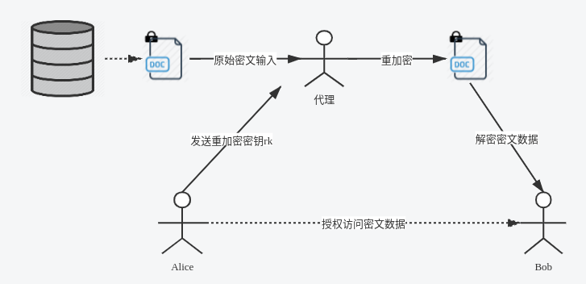

==========
密码学方案
==========

1. 国密sm2算法
==============

1.1. 概述
^^^^^^^^^

SM2算法是中华人民共和国政府采用的一种公钥加密标准，由国家密码管理局于2010年12月17日发布。在商用密码体系中，SM2用于替换RSA算法，可用来实现非对称加密、数字签名、密钥交换等功能。作为一种基于椭圆曲线的公钥密码算法，SM2算法在相同安全程度下，较RSA算法在密钥规模上存在优势。

======== ========== ============
\        SM2        RSA
======== ========== ============
密钥规模 192-256bit 2048-4096bit
======== ========== ============

算法标准包括4个部分：

   1) 总则，适用于基域为素域和二元扩域的椭圆曲线公钥密码算法；

   2) 数字签名算法，适用于商用密码应用中的数字签名和验证，可满足多种密码应用中的身份认证和数据完整性、真实性的安全需求；

   3) 密钥交换协议，适用于商用密码应用中的密钥交换，可满足通信双方经过两次或可选三次信息传递过程，计算获取一个由双方共同决定的共享秘密密钥（会话密钥）；

   4) 公钥加密算法，适用于商用密码应用中的消息加解密，消息发送者可以利用接收者的公钥对消息进行加密，接收者用对应的私钥进行解密；

相关标准为“GM/T 0003.1-2012 SM2
椭圆曲线公钥密码算法第1部分：总则”，“GM/T 0003.2-2012 SM2
椭圆曲线公钥密码算法第2部分：数字签名算法”，“GM/T 0003.3-2012 SM2
椭圆曲线公钥密码算法第3部分：密钥交换协议”，“GM/T 0003.4-2012 SM2
椭圆曲线公钥密码算法第4部分：公钥加密算法”，“GM/T 0003.5-2012 SM2
椭圆曲线公钥密码算法第5部分：参数定义“。

1.2. 签名算法
^^^^^^^^^^^^^

数字签名是附加在数据单元上的一些数据，或是对数据单元所作密码变换的结果，当正常应用时提供如下服务：

-  数据来源的确认；

-  数据完整性的验证；

-  签名者不可抵赖的保证。

数字签名算法由一个签名者对数据产生数字签名，并由一个验证者验证签名的可靠性。每个签名者有一个公钥和一个私钥，其中私钥用于产生签名，验证者用签名者的公钥验证签名。

在签名的生成过程之前，要用密码杂凑函数（哈希函数）对消息M
(包含\ :math:`Z_A`\ 和待签消息M)进行压缩。

同理，在验证过程之前，要用密码杂凑函数对\ :math:`M ′`
(包含\ :math:`Z_A`\ 和验证消息\ :math:`M′` )进行压缩。

1.2.1. 系统参数
---------------

椭圆曲线的系统参数为：

-  :math:`F_q`\ ：包含 :math:`q` 个元素的素域

-  椭圆曲线方程的参数a、b

-  :math:`G`\ ：椭圆曲线的基点（\ :math:`G=(x_G,y_G)`\ ）

-  :math:`n`\ ：基点G的阶，由基点\ :math:`G`\ 生成的群的元素的个数

-  可选项：n的余因子\ :math:`h`\ （\ :math:`h = |E(F_q)|/n`\ ）

除了定义了椭圆曲线的参数和签名算法所需要的辅助函数：哈希函数和随机数发生器外，标准引入了用户信息标识的概念。

签名者拥有长度为\ :math:`entlen_A`\ 比特的可辨别标识\ :math:`ID_A`\ ，在标准规定的签名算法中，需要在生成签名和验证签名前计算用户A的哈希值\ :math:`Z_A`\ 。\ :math:`Z_A=H_{256}(ENTL_A||ID_A|| a||b||x_G||y_G||x_A||y_A)`\ ，其中\ :math:`ENTL_A`\ 是由\ :math:`entl_A`\ 转换而成的两个字节。

1.2.2. 签名生成
---------------

1) 预处理

   计算\ :math:`Z_A`\ ：\ :math:`Z_A=H_{256}(ENTL_A||ID_A|| a||b||x_G||y_G||x_A||y_A)`

2) 签名

   输入：M，\ :math:`Z_A`\ ，私钥\ :math:`d_A`

   输出：签名对\ :math:`(r,s)`

   A1: 消息处理：\ :math:`\overline M= Z_A||M`

   A2: 计算\ :math:`e=H_v(\overline M)`

   A3: 产生随机数 :math:`k\in [1,n-1]`

   A4: 计算曲线点\ :math:`(x_1, y_1)=kG`

   A5: 计算\ :math:`r= (e+x_1)\ mod\  n`\ ，
   若\ :math:`r=0`\ 或\ :math:`r+k=n`\ 则返回A3

   A6: 计算
   :math:`s= ((1+d_A)^{-1} (k- r*d_A))\ mod\ n`\ ，若\ :math:`s=0`\ 则返回A3

   A7: 输出签名对\ :math:`(r,s)`

1.2.3. 签名验证
---------------

1) 预处理

   计算\ :math:`Z_A`\ ：\ :math:`Z_A=H_{256}(ENTL_A||ID_A|| a||b||x_G||y_G||x_A||y_A)`

2) 验证

   输入：消息\ :math:`M'`\ ，签名\ :math:`(r^{'}, s^{'})`\ ，
   公钥\ :math:`P_A`

   输出：1 or 0

   B1: 检验\ :math:`r′ ∈[1,n-1]`\ 是否成立，若不成立则验证不通过；

   B2: 检验\ :math:`s′ ∈[1,n-1]`\ 是否成立，若不成立则验证不通过；

   B3: 消息处理：\ :math:`\overline M^{'}= Z_A||M`

   B4: 计算 :math:`e'=H_v(\overline M^{'})`

   B5: 计算 :math:`t = (r'+ s')\ mod\ n`

   B6: 计算椭圆曲线点\ :math:`(x_1',y_1') = s'G+ tP_A`

   B7: 计算 :math:`R=(e'+x_1')\ mod\ n`\ ，检验
   :math:`R=r'`\ 是否成立，若成立则验证通过；否则验证不通过

1.2.4. 正确性说明
-----------------

展开步骤B6中的等式

.. math::

   \begin{align}
    s'G+ tP_A &= (s'+ (r'+s')d_A)G \\
    &= s'(1 + d_A)G + r'd_AG
    \end{align}

根据签名生成中A6步骤的等式，可得

.. math::

   k= s(1+d_A)+ rd_A 

因此，步骤B6中的等式可以恢复出签名生成的曲线点\ :math:`kG`

1.3. 密钥交换
^^^^^^^^^^^^^

密钥交换协议是两个用户A和B通过交互的信息传递，用各自的私钥和对方的公钥来商定一个只有他们知道的秘密密钥。这个共享的秘密密钥通常用在某个对称密码算法中。该密钥交换协议能够用于密钥管理和协商。

1.3.1. 密钥交换流程
-------------------

用户A和B双方为了生成相同的会话密钥，需要进行如下交互：

记\ :math:`w=⌈(⌈log_2(n)⌉/2)⌉−1。`

用户A：

A1：产生随机数\ :math:`r_A ∈ [1, n-1]`\ ；
A2：计算椭圆曲线点\ :math:`R_A = [r_A]G=(x_1,y_1)`\ ；
A3：将\ :math:`R_A`\ 发送给用户B；

用户B：

B1：产生随机数\ :math:`r_B ∈ [1, n-1]`\ ；

B2：计算椭圆曲线点\ :math:`R_B = [r_B]G=(x_2,y_2)`\ ；

B3：计算\ :math:`\overline x_2 = 2^w + (x_2\&(2^w −1))`\ ；

B4：计算\ :math:`t_B = (d_B +\overline x_2 ·r_B)\mod\ n`\ ；

B5：验证RA是否满足椭圆曲线方程，若不满足则协商失败；否则计算\ :math:`\overline x_1 = 2^w + (x_1\&(2^w −1))`

B6：计算椭圆曲线点\ :math:`V = [h ·t_B](P_A +[\overline x_1]R_A) = (x_V ,y_V )`\ ，若V是无穷远点，则B协商失败；

B7：计算\ :math:`K_B=KDF(x_V ∥ y_V ∥ Z_A ∥ Z_B,klen)`\ ；

B8：将\ :math:`R_B`\ 发送给用户A；

用户A：

A4：计算\ :math:`\overline x_1 = 2^w + (x_1\&(2^w −1))`

A5：计算\ :math:`t_A = (d_A +\overline x_1 ·r_A)\mod\ n`\ ；

A6：验证\ :math:`R_B`\ 是否满足椭圆曲线方程，若不满足则协商失败；否则计算\ :math:`\overline x_2 = 2^w + (x_2\&(2^w −1))`

A7：计算椭圆曲线点$U = `h ·t_A <P_B%20+%20%5B\overline%20x_2%5DR_B>`__ =
(x_U ,y_U ) $，若U是无穷远点，则A协商失败；

A8：计算\ :math:`K_A=KDF(x_U ∥ y_U ∥ Z_A ∥ Z_B,klen)`\ ；

PS：上述步骤省略了校验步骤。

正确性说明：

将步骤B6和步骤A7中生成的椭圆曲线点U和V分别展开，可得：

.. math::

   (x_V,y_V) = h( (d_B +\overline x_2 ·r_B))(d_A +\overline x_1 ·r_A)G

.. math::

    (x_U,y_U) = h( (d_A +\overline x_1 ·r_A))(d_B +\overline x_2 ·r_B)G

1.4. 公钥加密
^^^^^^^^^^^^^

公钥加密算法规定发送者用接收者的公钥将消息加密成密文，接收者用自已的私钥对收到的密文进行解密还原成原始消息。

1.4.1. 辅助函数
---------------

============= ===============================
:math:`klen`  要获得的密钥数据的比特长度
============= ===============================
参数          定义
:math:`H_v()` 其输出是长度恰为v比特的哈希函数
:math:`ct`    32比特构成的计数器
============= ===============================

辅助函数：

1) 哈希函数：使用国家密码管理局批准的密码杂凑算法，如SM3密码杂凑算法

2) :math:`KDF(Z, klen)`:

   1) 初始化计数器\ :math:`ct = 0x000000001`
   2) 对i从1到\ :math:`\lceil klen/v \rceil` 执行：

      1) 计算\ :math:`H_{a_i} = H_v(Z|| ct)`
      2) ct ++
         //之所以要计数器++，是为了满足最终KDF的输出是均匀随机的，如果不加的话，则每次hash输出的都是同一个值。
      3) 若 \ :math:`klen/v`\ 是整数，则 $H_a!\ *{:raw-latex:`\lceil `klen/v
         :raw-latex:`\rceil`} =H*\ {a_{:raw-latex:`\lceil `klen/v
         :raw-latex:`\rceil`}} $，否则
         $H_a!\ *{:raw-latex:`\lceil `klen/v :raw-latex:`\rceil`}
         :math:`为`\ H*\ {a_{:raw-latex:`\lceil `klen/v
         :raw-latex:`\rceil`}} :math:`最左边的(`\ klen - (v
         :raw-latex:`\times `:raw-latex:`\lfloor `klen/v
         :raw-latex:`\rfloor`)$)比特

   3) :math:`K = H_{a_1} || H_{a_2}||...||H_{a_{\lceil klen/v \rceil-1}} || H_a!_{\lceil klen/v \rceil}`

1.4.2. 加密流程
---------------

输入：消息M，\ :math:`klen`\ 为消息的长度，公钥\ :math:`P_B`

输出：临时公钥(:math:`C_1`)、密文（\ :math:`C_2`\ ）、消息认证码（\ :math:`C_3`\ ）

A1：产生随机数\ :math:`k∈[1,n-1]`\ ；

A2：计算椭圆曲线点\ :math:`C_1=[k]G=(x_1,y_1)`

A3：计算椭圆曲线点\ :math:`S=[h]P_B`\ ，若S是无穷远点，则报错并退出；

A4：计算椭圆曲线点\ :math:`[k]P_B=(x_2,y_2)` //
A与B共同持有的密钥，因为A知道B的公钥\ :math:`P_B`\ ，然后B是知道\ :math:`C_1=kG`\ ，B可以利用自己的私钥\ :math:`d_B`\ 与\ :math:`C_1`\ 计算出\ :math:`kP_B`\ 。

A5：计算\ :math:`t=KDF(x_2 ∥ y_2, klen)`\ ，若t为全0比特串，则返回A1；

A6：计算\ :math:`C_2 = M ⊕ t`\ ；//t不能全为0，如果全为0，则C_2=M

A7：计算\ :math:`C_3 = Hash(x_2 ∥ M ∥ y_2)`\ ；\ :math:`C_3`\ 验证消息的完整性，以及验证的确是A发出来的。

A8：输出密文\ :math:`C = C_1 ∥ C_2 ∥ C_3`\ 。

1.4.3. 解密流程
---------------

输入：密文\ :math:`C = C_1 ∥ C_2 ∥ C_3`\ ，私钥\ :math:`d_B`

输出：明文\ :math:`M'`\ 或fail

B1：验证\ :math:`C_1`\ 是否满足椭圆曲线方程，若不满足则报错并退出；

B2：计算椭圆曲线点\ :math:`S=[h]C_1`\ ，若S是无穷远点，则报错并退出；

B3：计算\ :math:`[d_B]C_1=(x_2,y_2)`

B4：计算\ :math:`t=KDF(x_2 ∥ y_2, klen)`\ ，若t为全0比特串，则报错并退出；

B5：计算\ :math:`M′ = C_2 ⊕ t`\ ；

B6：计算\ :math:`u = Hash(x_2 ∥ M′ ∥ y_2)`\ ，检验\ :math:`u = C_3`\ ，若检验失败则报错并退出；

B7：输出明文\ :math:`M'`

2. 代理重加密PRE
================

随着大数据和云端存储服务的兴起，越来越多的用户选择将数据交由云端服务商进行存储。为了保护用户数据的隐私，用户存储在云端的数据是以密文形式存在的。在现实应用中存在着大量数据共享的场景。

在传统的数据共享方案中，用户需先将加密存储在云端的文件进行下载，在本地解密，然后再使用密钥协商等方式将数据共享给数据使用方。而这种方式会耗费数据拥有者大量的通信和计算开销，并且将占用用户本地的存储空间。

代理重加密的提出为数据共享提供了新思路。它是一种允许第三方（代理）对密文进行重加密，从而使得被授权用户（数据使用者）可以解密的方案，实现了在不泄漏数据拥有者私密信息的情况下，云端密文数据的共享。该方案较传统方案在通信、计算和存储开销上都存在明显的优势，在文件共享，邮件转发等场景中存在着广泛的应用前景。下面我们通过如下一个简要的例子介绍PRE的流程：

假设用户Alice在云端加密存储了文件，现在Alice想要将该文件共享给另一个用户Bob。其做法如下：

-  Alice利用自己的私钥和Bob的私钥/公钥生成重加密密钥\ :math:`rk_{A\to B}`\ ，并把该密钥发送给代理；

-  代理使用重加密密钥\ :math:`rk_{A\to B}`\ 对Alice存放在云端的密文文件进行重加密；

-  Bob直接下载重加密后的文件，并使用自己的私钥对数据进行解密。

3. 零知识证明
=============

零知识证明这个概念最早由Goldwasser、Micali和Rackoff提出的，其表达核心思想是证明者要向验证者证明一个statement的正确性，与此同时不泄露任何额外的信息。它具有如下三个重要的性质：

-  完备性completeness

-  合理性soundness

-  零知识性zero-knowledge

近几年零知识证明被广泛应用到区块链中，如可验证的外包计算、匿名证书、范围证明、隐私密码学货币等需要平衡隐私性和机密性的应用场景，它已经在隐私性和可扩展性方面成为了一个非常重要的工具。在实际应用中客户端下载和验证交易频繁，因此要部署高效实用的零知识证明协议，需要该协议的证明足够小，验证足够高效（small
proof size and fast
verification）。随着密码学技术的不断发展，零知识证明的落地应用层出不穷。这些优秀的项目对零知识证明的技术的实用性进行了一系列的探索：

-  **基于UTXO模型的零知识证明协议**\ ：零知识证明在密码学货币上具有广泛的应用，Zcash是zk-SNARKs的首个应用，它利用Groth16协议，实现了基于UTXO模型下交易双方地址和金额的完全隐藏，并且能够生成较短的高效的可验证的证明。但是该技术需要采用CRS来构造zk-SNARK，即需要引入可信第三方来生成一组公共参考串，与此同时也引入了对可信第三方的信任问题，尽管可以利用MPC等技术实现分布式协作生成CRS，但是依然无法完全解决CRS的引入带来的信任问题。

-  **基于账户模型的零知识证明协议**\ ：当前的区块链隐私支付系统，如Zcash和Monero等，均是基于UTXO模型，而Zether协议能实现基于账户模型的隐私支付，且能实现交易双方和交易金额的匿名化，该协议以智能合约的形式，方便地部署到基于账户模型的区块链系统中，而不需要修改底层链的逻辑。此外AZTEC协议采用Plonk零知识证明协议，实现了基于Ethereum账户模型下的隐私交易。

-  **去CRS的零知识证明协议**\ ：目前在区块链领域中，大部分高效可验证的零知识证明协议都依赖于CRS。因此去CRS的零知识证明协议也是各个项目重点关注的话题。围绕该热议话题的主要分为两个方向：（1）探索完全去CRS的零知识证明协议，如bulletproof利用向量内积的方法实现了范围的证明，zk-STARK实现无需可信公共参数设置的证明，但是这两个零知识证明协议的证明较大，验证时间也较长。这也是完全去CRS的零知识证明协议不能被广泛应用的一个重要原因。

-  **CRS的可更新的零知识证明协议**\ ：基于CRS的零知识证明协议会引入第三方信任问题，完全去CRS的零知识证明协议产生的证明较大，验证不够高效，因此有项目尝试探索介于两者直接的一种零知识证明协议，即基于可更新的结构化参考串（updatable
   structured reference
   string）的协议，如Sonic、Plonk它们支持SRS的可更新操作，这两个协议本质上仍然是需要可信的参数设置，但是通过MPC等技术一定程度上提高了用户对CRS安全性的信心。目前AZTEC利用Plonk协议实现了Ethereum上的隐私交易。

-  **可扩展性的零知识证明协议**\ ：zk
   Rollup是一种新型的Layer2扩容方案，将链上的数据放到layer2解决。用户发送的交易，由relayer收集，生成零知识证明将发布交易后的新状态跟之前的状态捆绑在一起，保证用户状态变更的正确性。链上只存储用户状态的merkle树根，通过智能合约验证零知识证明的正确性。

-  **基于具体应用需求的零知识证明协议：**\ 在实际中还有许多基于具体应用需求，并利用上述提及的零知识证明技术设计出的协议，如在存储场景下，filecoin的时空证明（proof
   of spacetime）和复制证明（proof of
   replication）是利用zk-SNARKs的Succinct特性的典型案例；在公平交易的场景下，zkPoD实现零信任的去中心化公平交易系统，在不可信双方之间进行交易，确保买卖双方间交易的公平性。

目前零知识证明技术在实际应用中非常成熟，在我们的联盟链中，我们会根据实际的场景需求，采用或设计对应的零知识证明协议来满足我们的场景需求。
