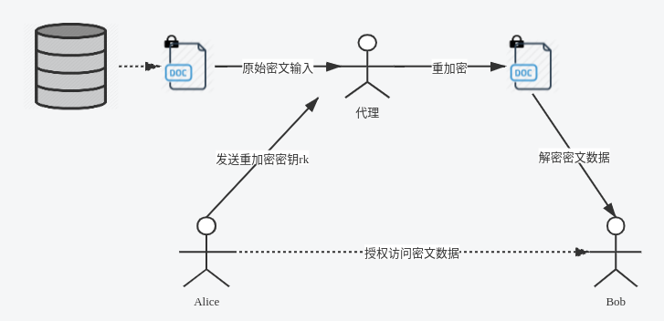

.. _pre:

================
代理重加密PRE
================

随着大数据和云端存储服务的兴起，越来越多的用户选择将数据交由云端服务商进行存储。为了保护用户数据的隐私，用户存储在云端的数据是以密文形式存在的。在现实应用中存在着大量数据共享的场景。

在传统的数据共享方案中，用户需先将加密存储在云端的文件进行下载，在本地解密，然后再使用密钥协商等方式将数据共享给数据使用方。而这种方式会耗费数据拥有者大量的通信和计算开销，并且将占用用户本地的存储空间。

代理重加密的提出为数据共享提供了新思路。它是一种允许第三方（代理）对密文进行重加密，从而使得被授权用户（数据使用者）可以解密的方案，实现了在不泄漏数据拥有者私密信息的情况下，云端密文数据的共享。该方案较传统方案在通信、计算和存储开销上都存在明显的优势，在文件共享，邮件转发等场景中存在着广泛的应用前景。下面我们通过如下一个简要的例子介绍PRE的流程：

假设用户Alice在云端加密存储了文件，现在Alice想要将该文件共享给另一个用户Bob。其做法如下：

-  Alice利用自己的私钥和Bob的私钥/公钥生成重加密密钥 :math:`rk_{A\to B}` ，并把该密钥发送给代理；

-  代理使用重加密密钥 :math:`rk_{A\to B}` 对Alice存放在云端的密文文件进行重加密；

-  Bob直接下载重加密后的文件，并使用自己的私钥对数据进行解密。

