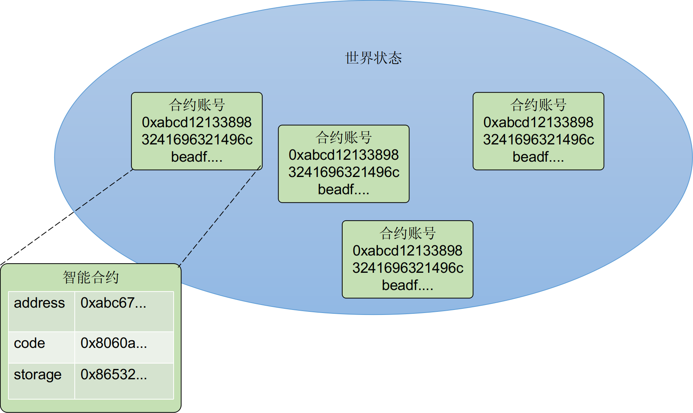
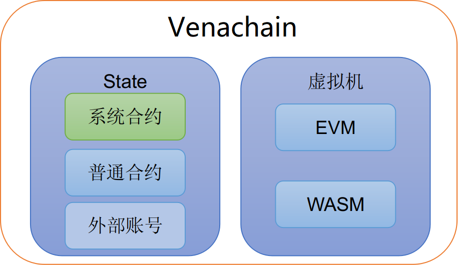

========
智能合约
========

1. 智能合约概要
===============

PlatONE中的智能合约是一段可以在链上运行的逻辑代码，合约以账户形式存在，称之为合约账户。合约账户状态的\ ``code``\ 字段中保存了合约的逻辑代码（即字节码），合约的调用可以看做是合约账号中的逻辑代码在虚拟机中执行。

PlatONE同时支持EVM和WASM两种类型智能合约虚拟机，其中EVM虚拟机兼容以太坊的solidity智能合约，WASM虚拟机可以支持C/C++/Rust等多种合约语言。

2.EVM虚拟机
===========

2.1. EVM原理
^^^^^^^^^^^^

以太坊上的虚拟机称之为EVM，是一个基于栈的虚拟机。现在有很多种以太坊智能合约语言，只要合约语言可以通过编译器编译成符合EVM虚拟机要求的特定指令集，就可以编写以太坊智能合约。现在最流行以太坊智能合约语言是Solidity。Solidity语言是一门静态语言，其编译器是solc。通过编译，Solidity语言变成特定格式的字节码，可以通过发送交易的方式可以把得到的字节码发送并存储到区块链上。

EVM 不是基于寄存器的，而是基于栈的，因此所有的计算都在一个被称为
栈（stack） 的区域执行。
栈最大有1024个元素，每个元素长度是一个字（256位）。对栈的访问只限于其顶端，限制方式为：允许拷贝最顶端的16个元素中的一个到栈顶，或者是交换栈顶元素和下面16个元素中的一个。所有其他操作都只能取最顶的两个（或一个，或更多，取决于具体的操作）元素，运算后，把结果压入栈顶。当然可以把栈上的元素放到存储或内存中。但是无法只访问栈上指定深度的那个元素，除非先从栈顶移除其他元素。

2.1.1. 指令集类型
-----------------

由于操作码被限制在一个字节以内，所以EVM指令集最多只能容纳256条指令。目前EVM已经定义了约142条指令，还有100多条指令可供以后扩展。这142条指令包括以下四大类：

-  基本操作码：算术运算指令，比较操作指令，按位运算指令，栈，跳转指令；

-  密码学计算操作码：密码学计算指令；例如：keccak256（好像只有这一个）

-  存储相关操作码：memory，storage操作指令；例如：mstore，sstore, sload,
   mload等等
   
-  与区块链的直接接口操作码：call、blockhash，log，caller，timestamp等。

2.1.2. 内存
-----------

合约会试图为每一次消息调用获取一块被重新擦拭干净的内存实例。
内存是线性的，可按字节级寻址，但读的长度被限制为256位，而写的长度可以是8位或256位。当访问（无论是读还是写）之前从未访问过的内存字（word）时（无论是偏移到该字内的任何位置），内存将按字进行扩展（每个字是256位）。扩容也将消耗一定的gas。
随着内存使用量的增长，其费用也会增高（以平方级别）。在初始化内存时是不会进行预先分配任何内存空间的，而是虚拟机会在执行每个一个指令之前先计算一下执行这个指令现在的内存是否够用，如果不够用的话，就用以下命令进行扩容。

.. code:: go

   // Resize resizes the memory to size
   func (m *Memory) Resize(size uint64) {
       if uint64(m.Len()) < size {
           m.store = append(m.store, make([]byte, size-uint64(m.Len()))...)
       }
   }

2.1.3. 部署合约
---------------

Solidity源码编译成的字节码至少包含两个部分。第一部分的\ ``.code``\ 包含了一些智能合约初始化的代码，比如构造函数，state
variable（全局变量）的赋值等操作。在部署合约时，会调用这部分代码进行初始化合约，并把返回的\ ``runtime bytecode``\ 永久存储到storage中。区块链浏览器，如Etherscan，默认是无法看到这部分的代码的。

2.1.4. 调用合约
---------------

函数签名是一个4bytes的hash值，用来唯一标识智能合约中的函数。它是通过sha3(“functionName(type1,
type2)”)，取前4bytes得到的。也就是说该函数签名只与函数名，形式参数类型有关。

从.data开始，是智能合约的runtime
bytecode，也就是在区块链上保存的合约的bytecode。

这部分字节码的开头是整个合约的所有可调用函数的函数签名，在调用合约的函数时，首先通过calldata操作码读取调用函数的函数签名的前四个字节，然后EVM是从头开始线性的往下依次加载每个函数签名，并进行比较，如果函数签名一致的话，则通过jumpi指令跳转到相应的函数进行操作。在EVM中，回退函数是唯一一个未命名的函数，如果遍历完所有的函数签名也没有匹配的函数的话，则会调用回退函数从而退出整个调用过程。

2.1.5. 案例
-----------

下面我们按照以下源码进行分析。

.. code:: bash

   pragma solidity ^0.5.11;
   contract SimpleStorage {
       uint storedData;

       function set(uint x) public {
           storedData = x;
       }

       function get() public view returns (uint) {
           return storedData;
       }
   }

源码编译后得到的二进制数据如下：

.. code:: console

   608060405234801561001057600080fd5b5060c68061001f6000396000f3fe6080604052348015600f57600080fd5b506004361060325760003560e01c806360fe47b11460375780636d4ce63c146062575b600080fd5b606060048036036020811015604b57600080fd5b8101908080359060200190929190505050607e565b005b60686088565b6040518082815260200191505060405180910390f35b8060008190555050565b6000805490509056fea265627a7a72315820f7616ca7610ee51eb34eb9619c012a95b32e296d4fcdefb15c4c6051175c683964736f6c634300050b0032

把以上代码作为交易的data部署到链上，但是作为合约code存储到链上的数据，是以上数据的子集，我们称之为Runtime
ByteCode如下所示：

.. code:: console

   6080604052348015600f57600080fd5b506004361060325760003560e01c806360fe47b11460375780636d4ce63c146062575b600080fd5b606060048036036020811015604b57600080fd5b8101908080359060200190929190505050607e565b005b60686088565b6040518082815260200191505060405180910390f35b8060008190555050565b6000805490509056fea265627a7a72315820f7616ca7610ee51eb34eb9619c012a95b32e296d4fcdefb15c4c6051175c683964736f6c634300050b0032

下面我们按照源码的汇编表示来进行具体分析。

.. code:: bash

   .code
     PUSH 80           contract SimpleStorage {\n    ...
     PUSH 40           contract SimpleStorage {\n    ...
     MSTORE            contract SimpleStorage {\n    ...
     CALLVALUE             contract SimpleStorage {\n    ...
     DUP1          olidity ^
     ISZERO            a 
     PUSH [tag] 1          a 
     JUMPI             a 
     PUSH 0            a
     DUP1          n
     REVERT            .11;\ncontrac
   tag 1           a 
     JUMPDEST          a 
     POP           contract SimpleStorage {\n    ...
     PUSH #[$] 0000000000000000000000000000000000000000000000000000000000000000            contract SimpleStorage {\n    ...
     DUP1          contract SimpleStorage {\n    ...
     PUSH [$] 0000000000000000000000000000000000000000000000000000000000000000         contract SimpleStorage {\n    ...
     PUSH 0            contract SimpleStorage {\n    ...
     CODECOPY          contract SimpleStorage {\n    ...
     PUSH 0            contract SimpleStorage {\n    ...
     RETURN            contract SimpleStorage {\n    ...
   .data
     0:
       .code
         PUSH 80           contract SimpleStorage {\n    ...
         PUSH 40           contract SimpleStorage {\n    ...
         MSTORE            contract SimpleStorage {\n    ...
         CALLVALUE             contract SimpleStorage {\n    ...
         DUP1          olidity ^
         ISZERO            a 
         PUSH [tag] 1          a 
         JUMPI             a 
         PUSH 0            a
         DUP1          n
         REVERT            .11;\ncontrac
       tag 1           a 
         JUMPDEST          a 
         POP           contract SimpleStorage {\n    ...
         PUSH 4            contract SimpleStorage {\n    ...
         CALLDATASIZE          contract SimpleStorage {\n    ...
         LT            contract SimpleStorage {\n    ...
         PUSH [tag] 2          contract SimpleStorage {\n    ...
         JUMPI             contract SimpleStorage {\n    ...
         PUSH 0            contract SimpleStorage {\n    ...
         CALLDATALOAD          contract SimpleStorage {\n    ...
         PUSH E0           contract SimpleStorage {\n    ...
         SHR           contract SimpleStorage {\n    ...
         DUP1          contract SimpleStorage {\n    ...
         PUSH 60FE47B1         contract SimpleStorage {\n    ...
         EQ            contract SimpleStorage {\n    ...
         PUSH [tag] 3          contract SimpleStorage {\n    ...
         JUMPI             contract SimpleStorage {\n    ...
         DUP1          contract SimpleStorage {\n    ...
         PUSH 6D4CE63C         contract SimpleStorage {\n    ...
         EQ            contract SimpleStorage {\n    ...
         PUSH [tag] 4          contract SimpleStorage {\n    ...
         JUMPI             contract SimpleStorage {\n    ...
       tag 2           contract SimpleStorage {\n    ...
         JUMPDEST          contract SimpleStorage {\n    ...
         PUSH 0            contract SimpleStorage {\n    ...
         DUP1          contract SimpleStorage {\n    ...
         REVERT            contract SimpleStorage {\n    ...
       tag 3           function set(uint x) public {\...
         JUMPDEST          function set(uint x) public {\...
         PUSH [tag] 5          function set(uint x) public {\...
         ....
         JUMPI             ag
         PUSH 0            r
         DUP1          o
         REVERT            5.11;\ncontra
       tag 6           ag
         JUMPDEST          ag
         .....
         PUSH [tag] 7          function set(uint x) public {\...
         JUMP [in]         function set(uint x) public {\...
       tag 5           function set(uint x) public {\...
         JUMPDEST          function set(uint x) public {\...
         STOP          function set(uint x) public {\...
       tag 4           function get() public view ret...
         JUMPDEST          function get() public view ret...
         PUSH [tag] 8          function get() public view ret...
         PUSH [tag] 9          function get() public view ret...
         JUMP [in]         function get() public view ret...
       tag 8           function get() public view ret...
         JUMPDEST          function get() public view ret...
         .....
         RETURN            function get() public view ret...
       tag 7           function set(uint x) public {\...
         JUMPDEST          function set(uint x) public {\...
         .....
         JUMP [out]            function set(uint x) public {\...
       tag 9           function get() public view ret...
         JUMPDEST          function get() public view ret...
         ......
         JUMP [out]            function get() public view ret...
       .data

在开始处标识\ ``.code``\ 的部分就是我们前面说智能合约部署时进行初始化的代码。在EVM中0x40地址是一个被预留的地址，称之为“空内存地址”：即内存中我们可以用来存储东西的地方，保证没有人会覆盖它（除非我们犯了错误）。而0x00到0x40之间的内存是用来保存计算哈希值，这个对于映射和其他类型的动态数据是必需的。

1) 要调用get()方法，需要根据sha3(“get()”)得到前4个字节，即函数签名6d4ce63c。
2) 在.code中的tag1，CALLDATASIZE会获取交易传入的参数长度，LT指令来比较是否小于4个字节，如果小于4个字节，则会跳转到tag2，整个合约运行完毕。这里的执行就是回退函数。
3) 如果不小于4个字节，则会继续执行CALLDATALOAD指令，CALLDATALOAD会把参数内容压入栈顶。
4) 然后在逻辑右移0xE0（224）位，原因是为了凑足256位。
5) 然后通过EQ指令，对比栈顶的两个数据是否一致，如果一直的话，跳转到相应的tag。如果不一致的话，继续向下执行下面的指令。
6) 找到了6d4ce63c函数签名的tag4，执行其代码。

在二进制的开头部分通常是用来判断一个函数是否是payable的。比如CALLVALUE指令会得到transacation是否发了eth，如果发了eth，ISZERO的结果就会是false，因此不会执行跳转。从这里可以看出来，对一个合约地址不可以同时进行转账和调用合约两项事情。

2.1.6. PlatONE对EVM支持情况说明
-------------------------------

PlatONE支持以太坊Byzantine的协议，后续更新的evm协议暂不支持（比如2019年更新的Constantinople、Istanbul等）。

在以太坊Byzantium版本之后，目前有以下几个版本，其中新增的字节码PlatONE暂不支持

-  Constantinople（2019.1.16更新）

Opcodes ``create2``, ``extcodehash``, ``shl``, ``shr`` and ``sar`` are
available in assembly.

-  Petersburg(2019.2.28更新) The compiler behaves the same way as with
   constantinople.

-  Istanbul (2019.12.7更新) Opcodes ``chainid`` and ``selfbalance`` are
   available in assembly.

目前PlatONE对solidity版本没有要求，0.4.x～0.6.x都可以使用，但是编译solidity合约时候需要明确指定EVM版本为Byzantium，因为目前

如果合约中涉及到Byzantium版本EVM不支持的功能，底层链也不会支持，变现为合约执行时gas耗尽。

2.1.7. 参考资料
---------------

1) https://solidity.readthedocs.io/en/v0.5.12/
2) http://remix.ethereum.org/#optimize=false&evmVersion=null&version=soljson-v0.5.11+commit.c082d0b4.js&appVersion=0.7.7
3) https://blog.csdn.net/Programmer_CJC/article/details/80218649
4) https://blog.csdn.net/notjusttech/article/details/80363911
5) https://arvanaghi.com/blog/reversing-ethereum-smart-contracts/
6) https://blog.trustlook.com/understand-evm-bytecode-part-1/
7) https://www.ratingtoken.net/news/41b22c70febd11e8a867795a7618abd3
8) http://qyuan.top/2019/09/12/evm/

3. Wasm虚拟机
=============

3.1. Wasm标准介绍
^^^^^^^^^^^^^^^^^

WebAssembly就像名字一样，是一个汇编语言，虽然开始时的构想是运行在Web上、独立于实际物理机器架构的抽象汇编语言。其抽象性在于只要浏览器实现了Wasm标准的汇编指令集，wasm模块就可以在其上执行，而不管物理机器的架构是什么。但是随着研究的深入和调研的反馈，发现Wasm不仅在浏览器上运行有着迫切的需求，非web领域也一样开始流行起来。

WebAssembly
并不是一门编程语言，而是一份字节码标准，需要用高级编程语言编译出字节码放到
WebAssembly
虚拟机中才能运行，可以通过编译器把高级语言，例如：C/C++，Rust等编译成Wasm字节码（也就是符合wasm汇编指令集的二进制代码），wasm运行速度很快，且体积很小。

2017年Wasm发布了MVP（Minimum Viable
Product，最小可行性版本）版本，现在基本上所有的主流浏览器已经全部支持。

3.1.1. WebAssembly原理
----------------------

由于不同的计算机 CPU 架构不同，机器码标准也有所差别，常见的 CPU 架构包括
x86、AMD64、ARM，
因此在由高级编程语言编译成可自行代码时需要指定目标架构。

WebAssembly 字节码是一种抹平了不同 CPU 架构的机器码，WebAssembly
字节码不能直接在任何一种 CPU 架构上运行，
但由于非常接近机器码，可以非常快的被翻译为对应架构的机器码，因此
WebAssembly 运行速度和机器码接近，这听上去非常像 Java 字节码。

相对于 JS，WebAssembly 有如下优点：

-  体积小：由于浏览器运行时只加载编译成的字节码，一样的逻辑比用字符串描述的
   JS 文件体积要小很多；

-  加载快：由于文件体积小，再加上无需解释执行，WebAssembly
   能更快的加载并实例化，减少运行前的等待时间；

每个高级语言都去实现源码到不同平台的机器码的转换工作是重复的，高级语言只需要生成底层虚拟机(LLVM)认识的中间语言(LLVM
IR)，\ `LLVM <https://llvm.org/>`__\ 能实现：

-  LLVM IR 到不同 CPU 架构机器码的生成；

-  机器码编译时性能和大小优化。

除此之外 LLVM 还实现了 LLVM IR 到 WebAssembly
字节码的编译功能，也就是说只要高级语言能转换成 LLVM IR，就能被编译成
WebAssembly 字节码。

通常负责把高级语言翻译到 LLVM IR 的部分叫做编译器前端，把 LLVM IR
编译成各架构 CPU 对应机器码的部分叫做编译器后端；
现在越来越多的高级编程语言选择 LLVM
作为后端，高级语言只需专注于如何提供开发效率更高的语法同时保持翻译到
LLVM IR 的程序执行性能。

3.1.2. 平台接口访问
-------------------

依赖于执行 JavaScript 的运行时环境，可以通过 JavaScript
程序来直接访问这些平台所暴露出的指定接口。比如，当你在浏览器中运行
JavaScript，网络应用可以调用一系列的网页接口来控制浏览器／设备的功能且访问
DOM，CSSOM，WebGL，IndexedDB，Web Audio API 等等。

然而，WebAssembly 模块不能够访问任何平台的接口。所有的这一切都得由
JavaScript 来进行协调。如果你想在 WebAssembly
模块内访问一些指定平台的接口，你必须得通过 JavaScript 来进行调用。

举个例子，如果你想要使用 console.log，你就得通过JavaScript 而不是 C++
代码来进行调用。而这些 JavaScript 调用会产生一定的性能损失。

情况不会一成不变的。规范将会为在未来为 wasm
提供访问指定平台的接口，这样你就可以不用在你的程序中内置 JavaScript。

现在WASI正在做这方面的努力，让WASM有直接访问物理平台的能力。

3.1.3. 类型
-----------

目前的 WebAssembly
类型系统还很小，只有四种数字类型（int32,int64,float32,float64）。目前，如果要使用复杂类型（例如字符串、对象、数组、结构体），需要将它们序列化为线性内存，并提供它们所在位置的引用，这样就会多出来很多性能开销。现在有一个提案对类型系统进行了扩展，添加了一个新的
anyref 类型，模块可以持有对主机环境对象的引用，也就是说，你可以将 JS
对象传给 wasm 模块。

通过 anyref 引用的对象对于 wasm
模块来说意义不是很大，关键在于模块可以持有在 JS
堆上分配的对象的引用，这意味着在 wasm
执行期间需要对这些引用进行跟踪。该提案被视为垃圾回收提案的垫脚石。

3.1.4. 内存回收
---------------

目前为止，WebAssembly 不支持垃圾回收。内存操作都是手动控制的（像
C、C++一样）。在wasm虚拟机中占用内存的有如下内容：

-  复杂类型（例如字符串、对象、数组、结构体）

-  手动malloc的内存。需要虚拟机提供import类型的malloc方法。

手工回收内存是非常麻烦的一件事情，在区块链的情况下，也可以选择不回收内存，因为一般智能合约都不会一直运行（gas等机制进行限制），运行完毕后，虚拟机实例就会销毁，连带着分配的内存也一样会被宿主程序回收。

目前，需要垃圾回收器的编程语言没有其他选择，只能将 GC 编译为
wasm，并将其作为二进制文件的一部分，例如 AssemblyScript
就在二进制文件中包含了一个“makeshift
GC”。但这样会增加二进制文件的大小，同时 GC
算法的效率也会受到影响。当然这个看编译器如何实现的，编译器也可以直接放弃垃圾回收。

3.1.5. 多线程
-------------

目前 WebAssembly 不支持多线程。但是，这有可能是接下来 WebAssembly
要实现的。Wasm 将会接近实现原生的线程（比如，C++
风格的线程）。拥有真正的线程将会在浏览器中创造出很多新的机遇。并且当然，会增加滥用的可能性。

3.1.6. 如何保证安全
-------------------

在WASM标准中，内存就是预先分配的一个数组，而内存地址就是数组索引，就算wasm代码操纵内存地址进行越界访问（C/C++很多漏洞就是这样操作的），也不会影响到别的程序，从而保证了内存安全，且wasm无法直接访问物理平台的接口，这样就现实了所谓的沙箱。

3.1.7. 应用场景
---------------

因为Wasm是已经经过编译优化过后的、静态的语言，所以其运行速度会比JavaScript快很多，且Wasm标准的跨平台的，以下场景非常适合使用wasm技术。

-  在线视频/直播编解码

-  在线图像和视频处理应用

-  高性能Web游戏

-  区块链

3.2. Wasm虚拟机原理
^^^^^^^^^^^^^^^^^^^

3.2.1. 基于栈的虚拟机
---------------------

WebAssembly不仅是一门编程语言，也是一套虚拟机体系结构规范。

3.2.1.1. 栈
>>>>>>>>>>>

栈是一种先进后出的数据结构，我们可以把栈理解为一种特殊化的数组，它被限制为只能从一端执行插入和删除操作，习惯上这一端被称为栈顶，而对应的另一端被称为栈底。栈有两种基本操作。

-  压入：或者入栈，在栈顶添加一个元素，栈中的元素个数加1。

-  弹出：或者说出栈，将栈顶的元素删除，栈中的元素个数减1。

3.2.1.2. WebAssembly 栈式虚拟机
>>>>>>>>>>>>>>>>>>>>>>>>>>>>>>>

大多数硬件的CPU体系中都有一定数量的通用和专用寄存器（如IA32中的EAX、EBX、ESP等），CPU指令使用这些寄存器存放操作数，执行数值运算、逻辑运算、内存读写等操作。而在WebAssembly体系中，没有寄存器，操作数存放在运行时的栈上，因此WebAssembly虚拟机是一种栈式虚拟机。

除了nop之类的特殊指令外，绝大多数的WebAssembly指令都是在栈上执行某种操作。下面给出几个具体示例：

-  i32.const n：在栈上压入值为n的32位整型数。

-  i32.add：从栈顶弹出2个32位整型数，计算它们的和并将结果入栈。

-  i32.eq：从战顶弹出2个32位整型数，比较它们是否相等，相等的话，在栈中压入1，否则压入0。

3.2.2. 二进制编码
-----------------

LEB128（Little Endian
Base128）是一种用于整数的、基于小端模式的可变长编码。所谓“可变长编码”是指待编码的源数据在经过编码算法后得到的编码结果长度是不固定的。通过使用可变长编码，可以对源数据进行无损数据压缩，可以在一定程度上保证Wasm模块的体积大小处于最优状态。

LEB128编码的核心思想主要有两点：

-  采用小端序表示数据编码。

-  采用128进制编码数据。

在主流的编程语言中，一个整型数一般采用本地机器序表示，同时每个字节8位（bit）用于表达256进制的一个数位。如果每个字节只用于表达LEB128的128进制的一个数位，那么将只需要使用7位。LEB128将每个字节剩余的1位用于表达是否终止的标志位，如果标志位为1表示编码数据还没有结束，如果标志位为0则表示编码已经结束。

对于一个32位的整数，LEB128编码后的数据长度最小为1个字节，最多为5个字节。对于小于128大小的数字，LEB128编码只需要一个字节就可以表示，而对于大于2^28的int32类型的整数，则需要5字节才能表示。

3.2.3. 头部和段数据
-------------------

WebAssembly不仅仅提供了运行时指令规范，还提供了模块的二进制封装规范。

头部和段数据是一个WebAssembly模块二进制文件最外层的结构。头部标识WebAssembly模块和版本信息，段数据则是保存各种模块数据。

3.2.3.1. 头部
>>>>>>>>>>>>>

WebAssembly以模块为基本单元，而最简单的模块可以没有任何代码：

.. code:: bash

   (module)

用wat2wasm工具将上述WebAssembly汇编代码编译为二进制模块：

.. code:: bash

   wat2wasm -v program.wat
   
.. code:: console
   
   0000000: 0061 736d                                 ; WASM_BINARY_MAGIC
   0000004: 0100 0000                                 ; WASM_BINARY_VERSION

开头的4字节分别为0x00、0x61、0x73、0x6d对应的ASCII码为\ ``\0asm``\ 字符串魔数。后面的4字节则是当前WebAssembly文件的版本，目前只有版本1。

3.2.3.2. 段类型列表
>>>>>>>>>>>>>>>>>>>

模块主体由多个段组成，段数据包含了模块段全部信息。WebAssembly规范为每个不同段分配了一个唯一段ID，如下表所示：

== ==================
ID 段名称
== ==================
0  自定义段（Custom）
1  类型段（Type）
2  倒入段（Import）
3  函数段（Function）
4  表格段（Table）
5  内存段（Memory）
6  全局段（Global）
7  导出段（Export）
8  开始段（Start）
9  元素段（Elem）
10 代码段（Code）
11 数据段（Data）
== ==================

为了研究段数据段组织方式，我们在模块中添加一个简单的函数：

.. code:: bash

   (module
       (func (result i32)
           i32.const 55
       )
   )

模块中的函数没有输入参数，只返回一个整数常量。我们用wat2wasm命令查看一下生成的二进制数据：

.. code:: bash

   wat2wasm -v demo.wat
   
.. code:: console

   0000000: 0061 736d                                 ; WASM_BINARY_MAGIC
   0000004: 0100 0000                                 ; WASM_BINARY_VERSION
   ; section "Type" (1)
   0000008: 01                                        ; section code
   0000009: 00                                        ; section size (guess)
   000000a: 01                                        ; num types
   ; type 0
   000000b: 60                                        ; func
   000000c: 00                                        ; num params
   000000d: 01                                        ; num results
   000000e: 7f                                        ; i32
   0000009: 05                                        ; FIXUP section size
   ; section "Function" (3)
   000000f: 03                                        ; section code
   0000010: 00                                        ; section size (guess)
   0000011: 01                                        ; num functions
   0000012: 00                                        ; function 0 signature index
   0000010: 02                                        ; FIXUP section size
   ; section "Code" (10)
   0000013: 0a                                        ; section code
   0000014: 00                                        ; section size (guess)
   0000015: 01                                        ; num functions
   ; function body 0
   0000016: 00                                        ; func body size (guess)
   0000017: 00                                        ; local decl count
   0000018: 41                                        ; i32.const
   0000019: 37                                        ; i32 literal
   000001a: 0b                                        ; end
   0000016: 04                                        ; FIXUP func body size
   0000014: 06                                        ; FIXUP section size

忽略模块头部信息，根据注释可以发现二进制模块含有3个段，分别为Type、Function、Code，其中Type段从0000008地址开始，第一个字节01为段ID；Function段从000000f地址开始，第一个字节03为段ID；Code从0000013开始，第一个字节0a为段ID。每个段ID的后面跟着的是后续段数据的长度。

段结构的二进制数据组成方式如下表所示：

============ =========== =================================
段名称       类型        描述信息
============ =========== =================================
ID           varuint7    用于标识段类型
payload_len  varuint32   段内容长度
name_len     varuint32 ? 段名长度（用于自定义段，即ID为0）
name         bytes ？    段名内容（用于自定义段，即ID为0）
payload_data bytes       段具体内容
============ =========== =================================

每个段结构二进制组成方式都如上表所示，但每个段内部具体内容的格式则各不相同。下面以Type段为例进行解析段的具体格式。

3.2.3.3. Type段（Type Section）
>>>>>>>>>>>>>>>>>>>>>>>>>>>>>>>

Type段的主要作用是用来保存所有导入该模块或直接定义在模块内的函数的函数签名类型（由函数的形式参数和返回值类型共同决定）。

Type段类型的字段组成结构如下：

======== =========== ====================
字段名称 类型        描述信息
======== =========== ====================
count    varuint32   函数签名实体的个数
entries  func_type\* 函数签名实体（多个）
======== =========== ====================

func_type实体类型的字段组成结构如下：

+---------+--------+---------------------------------------------------+
| 字段    | 类型   | 描述信息                                          |
+=========+========+===================================================+
| form    | v      | 类型构造符“func”对应的OpCode值：0x60              |
|         | arint7 |                                                   |
+---------+--------+---------------------------------------------------+
| para    | var    | 函数定义的形式参数个数                            |
| m_count | uint32 |                                                   |
+---------+--------+---------------------------------------------------+
| para    | value  | 函数形式参数类型（由类型构造符表示） i32: 0x7F    |
| m_types | _type*  | i64: 0x7E f32: 0x7D f64: 0x7C                    |
+---------+--------+---------------------------------------------------+
| retur   | va     | 函数的返回值个数                                  |
| n_count | ruint7 |                                                   |
+---------+--------+---------------------------------------------------+
| retu    | Value  | 函数的返回值类型（由类型构造符表示）              |
| rn_type | _type? |                                                   |
+---------+--------+---------------------------------------------------+

3.2.4. 虚拟指令集
-----------------

MVP版本的WebAssembly虚拟指令一共191条。大体上可以分为以下10大类。EVM直接在指令集里面添加了一些与底层链交互的指令，例如：balance，call，coinbase，timestamp等，而WebAssembly则是可以通过import特性，更加灵活的添加一些方法与底层链进行交互，在PlatONE中添加了caller，origin，balance，getstate，setstate等import方法与底层链进行交互。

3.2.4.1. 数据类型
-----------------

-  i32：32位整型数

-  i64：64位整型数

-  f32: 32位浮点型数，IEEE 754标准

-  f64: 64位浮点型数，IEEE 754标准

3.2.4.2. 常数指令
-----------------

-  i32。const x：在栈上压入值为x的i32值

3.2.4.3. 算术运算指令
>>>>>>>>>>>>>>>>>>>>>

算术运算指令的返回值（即运算后压入栈上的值）的类型都与其指令前缀类型一致，即以“i32.”为前缀的指令返回值类型均为i32，其他类型类似。

-  I32.add:
   i32求和。从栈顶依次弹出1个i32的值a，1个i32的值b，计算a+b的值压入栈顶。
   
-  求和、求差、求积、求商、求余、求反、求绝对值、取最小值、取整、求平方根、向上取整等等。

3.2.4.4. 位运算指令
>>>>>>>>>>>>>>>>>>>

位运算指令的返回值（即运算后压入栈上的值）的类型都与其指令前缀类型一致。

-  i32.clz：从栈顶弹出1个i32的值v，计算从v的二进制值的最高位起，连续为0的位数个数k，将k压入栈。

-  按位与、按位或、按位异或、左移、数学右移、循环左移、逻辑右移、循环右移等等。

3.2.4.5. 变量访问指令
>>>>>>>>>>>>>>>>>>>>>

-  get_local x：将x指定的局部变量的值压入栈；x是局部变量的索引或别名。

-  set_local, tee_local,get_global, set_global

3.2.4.6. 内存访问指令
>>>>>>>>>>>>>>>>>>>>>

-  i32.load offset=o
   align=a：从栈顶弹出1个i32的值addr，从内存的addr+o偏移处读取1个i32的值压入栈。a为地址对齐值，取值位1，2，4，8。“offset=…”可以省略，默认值为0；“align=…”可省略，默认值为0。

-  i64.load, f32.load, f64.load, i32.load8_s, i64.load16_u等等。

-  i64.store16 offset=o align=a:
   从栈顶依次弹出1个i64的值value、1个i32的值addr，在内存的addr+o偏移处写入value低16位（写入2字节）。a为地址对齐值，取值位1，2，4，8。“offset=…”可以省略，默认值为0；“align=…”可省略，默认值为2。

-  i32.store, i64.store, f32.store, f64.store, i64.store32等等。

-  memory.size：
   当前内存容量（i32型）压入栈，以页位单位（1页=64K=65536字节）。

-  memory.grow：
   令内存的当前容量为c，从栈顶弹出1个i32的值v，将内存的容量扩大为c+v，以页为单位。如果扩容成功，将值为c的i32压入栈，否则将值为-1的i32压入栈。内存新扩大的部分全部初始化为0的值。

3.2.4.7. 比较指令
>>>>>>>>>>>>>>>>>

比较指令的返回值（即运算后压入栈上的值）均为i32。

-  i32.eqz: 从栈顶弹出1个i32的值v，若v为0，则在栈中压入1，否则压入0。

-  i32.eq, i32.ne, i32.lt_s, i32.gt_s, i32.gt_u, i32.le_s, i64.lt_s,
   f32.lt,
   f32.ge（是否等于、是否小于、是否小于等于、是否大于等于）等等。

3.2.4.8. 类型转换指令
>>>>>>>>>>>>>>>>>>>>>

-  i32.wrap/i64:
   从栈顶弹出1个i64的值v，高32位舍弃，将其低32位的i32值压入栈。
   
-  i32转i64、f32转i32等等类型转换。

3.2.4.9. 控制流指令
>>>>>>>>>>>>>>>>>>>

-  call f：
   f为函数别名或函数索引。根据f指定的函数的签名初始化参数并调用它。
   
-  return： 跳出函数。

-  br l：
   l为label别名或label相对层数（即相对于当前代码块的嵌套深度）。跳转到l指定的label索引的代码块的后续点。
   
-  br_if, br_table, call_indirect, loop/end, block/end,
   if/else/end等等。

3.2.4.10. 其他指令
>>>>>>>>>>>>>>>>>>

-  unreachable: 触发异常，抛出WebAssembly.RuntimeError。

-  nop： 什么也不做。

-  drop： 从栈顶弹出1个值，无视类型。

-  select：依次从栈顶弹出1个i32的值c、1个值b、1个值a，若c不为0，则将a压入栈，否则将b压入栈。a和b必须为同一种类型。

3.2.5. 合约调用
---------------

合约调用时首先从Export段中根据field_str和kind两个字段获取到函数的index，然后从Code段根据上面得到的index获取函数体代码并运行。

3.2.5.1. Export段
>>>>>>>>>>>>>>>>>

可被外部用户调用的合约方法被称为export方法。一个合约所有可导出会统一放置在Export段中。Export段的二进制组成结构如下表所示：

======== ============== ======================
字段名称 类型           描述信息
======== ============== ======================
count    varuint32      可导出函数的数量
entries  export_entry\* 可导出函数实体（多个）
======== ============== ======================

export_entry的二进制组成结构如下：

========= ============= ============================
字段名称  类型          描述信息
========= ============= ============================
field_len varuint32     字段名称的长度（单位：byte）
field_str bytes         字段名称：UTF-8编码表示
kind      external_kind 导出类型
index     varuint32     可导出实体的索引
========= ============= ============================

external_kind的二进制组成结构如下：

==== ==================
数值 描述信息
==== ==================
0    （Function）函数
1    （Table）表
2    （Memory）内存
3    （Global）全局变量
==== ==================

二进制代码如下：

.. code:: console

   ; section "Export" (7)
   0000015: 07                                        ; section code
   0000016: 00                                        ; section size (guess)
   0000017: 01                                        ; num exports
   0000018: 08                                        ; string length
   0000019: 5f5a 3361 6464 6969                      _Z3addii  ; export name
   0000021: 00                                        ; export kind
   0000022: 00                                        ; export func index
   0000016: 0c                                        ; FIXUP section size

3.2.5.2. Code段
>>>>>>>>>>>>>>>

Code段的二进制如下：

======== =============== ================
字段名称 类型            描述信息
======== =============== ================
count    varuint32       函数体数量
bodies   function_body\* 函数实体（多个）
======== =============== ================

function_body的二进制组成结构如下：

=========== ============= ==================
字段名称    类型          描述信息
=========== ============= ==================
body_size   varuint32     函数体大小
local_count varuint32     局部变量数量
locals      local_entry\* 局部变量（多个）
code        bytes\*       函数实体代码
end         byte          0x0b。表示函数结束
=========== ============= ==================

local_entry的二进制组成结构如下：

======== ========== ===================================
字段名称 类型       描述信息
======== ========== ===================================
count    varuint32  以下类型变量的数量
type     value_type 变量类型；只有i32,i64,f32,f64四种。
======== ========== ===================================

二进制如下：

.. code:: console

   ; section "Code" (10)
   0000023: 0a                                        ; section code
   0000024: 00                                        ; section size (guess)
   0000025: 01                                        ; num functions
   ; function body 0
   0000026: 00                                        ; func body size (guess)
   0000027: 00                                        ; local decl count
   0000028: 20                                        ; local.get
   0000029: 01                                        ; local index
   000002a: 20                                        ; local.get
   000002b: 00                                        ; local index
   000002c: 6a                                        ; i32.add
   000002d: 0b                                        ; end
   0000026: 07                                        ; FIXUP func body size
   0000024: 09                                        ; FIXUP section size

3.2.6. 参考资料
---------------

1) https://webassembly.github.io/spec/core/appendix/index-instructions.html
2) http://webassemblycode.com/dissecting-minimum-useful-webassembly-module/
3) https://wasdk.github.io/WasmFiddle/

