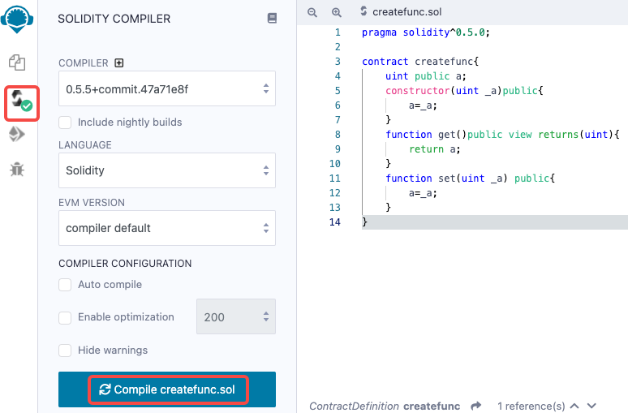
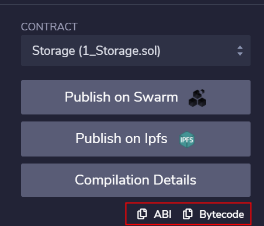

==============
合约编译
==============

使用Remix方式
================

打开已经写好.sol文件 -> 选择左边栏Solidity Compiler -> 点击按钮Compile XXX.sol

编译好之后，在左边栏可以点击复制ABI内容，自行创建文件并将内容粘贴到文件中进行保存

使用solc方式
=============

在前面章节已经介绍了如何安装solidity的命令行编译器solc。该编译器可以生成各种输出，范围从简单的二进制文件、汇编文件到用于估计 ``gas`` 使用情况的抽象语法树（解析树）。

使用如下命令来查看它的所有选项的解释：

.. code:: bash

   solc --help

使用如下命令可以在 ``Storage_output`` 文件夹中生成二进制bin文件和abi文件：

.. code:: bash

   solc --bin --abi -o Storage_output Storage.sol