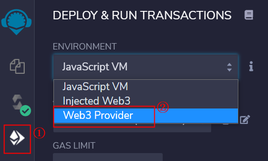
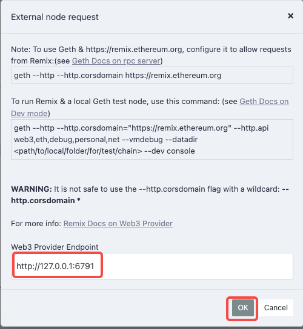
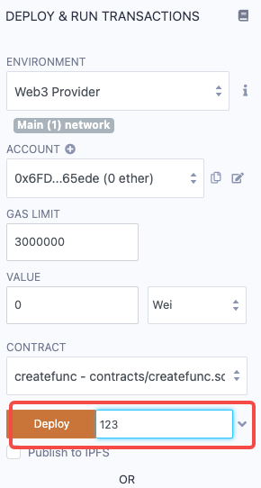
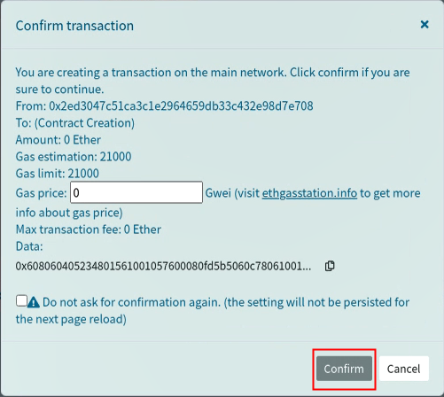
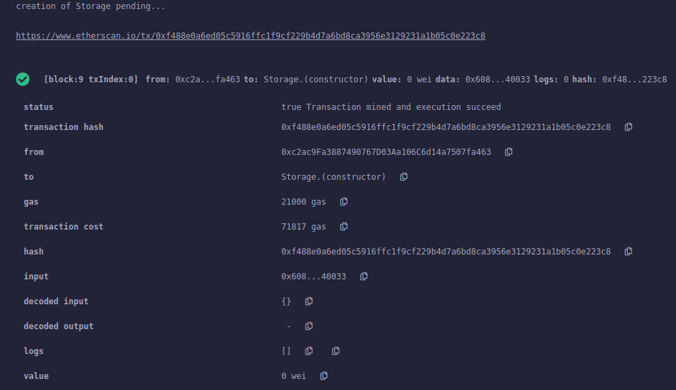
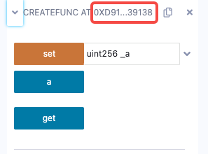
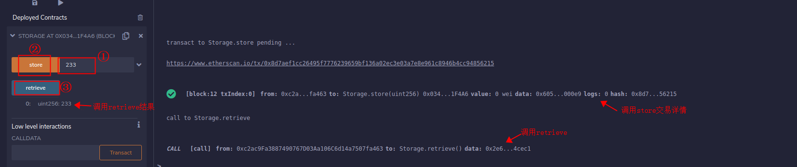

===============
合约部署与调用
===============

使用Remix方式
=============

合约部署
^^^^^^^^^^^^^^

选择左边栏Deploy & run transactions -> 选择ENVIRONMENT -> 选择ACCOUNT,设置GAS LIMIT等 -> 选择CONTRACT -> 点击Deploy进行部署。

选择Web3 Provider后会弹出如下提示框，需要在Web3 Provider EndPoint中填入Venachain节点的IP和RPC端口号。点击OK确认。

点击Deploy后，会出来如下弹框，进行Confirm确认。

之后Remix便将合约部署在前面设定的Venachain的节点上，页面会在右下角的框中给出合约部署的相关信息，如下所示。

左边框会显示智能合约地址：

也可以根据交易哈希，可以在链上查询智能合约地址：

.. code:: console

   > eth.getTransactionReceipt("0xf488e0a6ed05c5916ffc1f9cf229b4d7a6bd8ca3956e3129231a1b05c0e223c8") 

   { 
   blockHash: "0x2f6276288a4c80cc502f25a8344c7b15f50b2ab2070f68758821a867d89232e4", 
   blockNumber: 9, 
   contractAddress: "0x034265dabe530aa58df4a2f9112c76947901f4a6", cumulativeGasUsed: 71817, 
   from: "0xc2ac9fa3887490767d03aa106c6d14a7507fa463", 
   gasUsed: 71817, 
   logs: [], 
   logsBloom: "0x00000000000000000000000000000000000000000000000000000000000000000000000000000000000000000000000000000000000000000000000000000000000000000000000000000000000000000000000000000000000000000000000000000000000000000000000000000000000000000000000000000000000000000000000000000000000000000000000000000000000000000000000000000000000000000000000000000000000000000000000000000000000000000000000000000000000000000000000000000000000000000000000000000000000000000000000000000000000000000000000000000000000000000000000000000000", 
   status: "0x1", 
   to: null, 
   transactionHash: "0xf488e0a6ed05c5916ffc1f9cf229b4d7a6bd8ca3956e3129231a1b05c0e223c8",
   transactionIndex: 0
   }

合约调用
^^^^^^^^^^^^

在线调用
-----------

通过vcl调用
--------------

调用store方法：

.. code:: bash

   ./vcl contract execute "0x034265dabe530aa58df4a2f9112c76947901f4a6" "store" --param 111 --abi ../../../../contracts/Storage.abi.json --vm evm --keyfile ../conf/keyfile.json

结果如下：

.. code:: console

   Passphrase: 
   { 
   "blockHash": "0x90277159dae5d58ce2f06be0c79ef652ad56e494c8c79e35b964edf97c65d96d", 
   "blockNumber": "0xb", 
   "contractAddress": "", 
   "cumulativeGasUsed": "0xa2ea", 
   "from": "0xc2ac9fa3887490767d03aa106c6d14a7507fa463", 
   "gasUsed": "0xa2ea", 
   "root": "", 
   "to": "0x034265dabe530aa58df4a2f9112c76947901f4a6", 
   "transactionHash": "0x54cfe47bcd738d496a18334e56d8a4964994899843ae5f0b8fa77bf96d1b4614",
   "transactionIndex": "0x0", 
   "logs": [], 
   "status": "0x1" 
   } 
   result0: 
   { 
   "status": "Operation Succeeded", 
   "blockNumber": 11, 
   "GasUsed": 41706, 
   "From": "0xc2ac9fa3887490767d03aa106c6d14a7507fa463", 
   "To": "0x034265dabe530aa58df4a2f9112c76947901f4a6", 
   "TxHash": "" 
   }

调用retrieve方法

.. code:: bash

   ./vcl contract execute "0x034265dabe530aa58df4a2f9112c76947901f4a6" "retrieve" --abi ../../../../contracts/Storage.abi.json --vm evm --keyfile ../conf/keyfile.json

结果：

.. code:: console

   Passphrase: 
   result0: 
   111

使用vcl方式
============

部署合约
^^^^^^^^^^

.. code:: bash

   ./vcl contract deploy ../../../cmd/vcl/test/test_case/sol/storage_byzantium_065.bin --abi ../../../cmd/vcl/test/test_case/sol/storage_byzantium_065.abi -vm evm --keyfile ../conf/keyfile.json 

会提示输入密码，默认密码为0。输入密码后结果如下：

.. code:: console

   Passphrase: 
   {   
   "blockHash": "0x66d19fb27341ac21c42404aa944204015abec69e9fdbc2d931dbb6a12be09284",   
   "blockNumber": "0x6",   
   "contractAddress": "0x4ba7169041ca383ac19b5496eaf94ce00c464658",   "cumulativeGasUsed": "0x12c41",   
   "from": "0xc2ac9fa3887490767d03aa106c6d14a7507fa463",   
   "gasUsed": "0x12c41",   
   "root": "",   
   "to": "",   
   "transactionHash": "0x1ab1bce53dc54b9f63996139f987d71d1169610938ab261002fa36425346cc7f", 
   "transactionIndex": "0x0",   
   "logs": [],   
   "status": "0x1" 
   }
   result:{   
   "status": "Operation Succeeded",   
   "contractAddress": "0x4ba7169041ca383ac19b5496eaf94ce00c464658", 
   "blockNumber": 6,   
   "GasUsed": 76865,   
   "From": "0xc2ac9fa3887490767d03aa106c6d14a7507fa463",   
   "To": "",   
   "TxHash": "" 
   }

为确定合约部署成功，可以在console界面进行查询，交易状态为0x1即为成功。

.. code:: console

   > eth.getTransactionReceipt("0x1ab1bce53dc54b9f63996139f987d71d1169610938ab261002fa36425346cc7f") 
   {   
   blockHash: "0x66d19fb27341ac21c42404aa944204015abec69e9fdbc2d931dbb6a12be09284",  
   blockNumber: 6,   
   contractAddress: "0x4ba7169041ca383ac19b5496eaf94ce00c464658",
   cumulativeGasUsed: 76865,   
   from: "0xc2ac9fa3887490767d03aa106c6d14a7507fa463",   
   gasUsed: 76865,   
   logs: [],   
   logsBloom: "0x00000000000000000000000000000000000000000000000000000000000000000000000000000000000000000000000000000000000000000000000000000000000000000000000000000000000000000000000000000000000000000000000000000000000000000000000000000000000000000000000000000000000000000000000000000000000000000000000000000000000000000000000000000000000000000000000000000000000000000000000000000000000000000000000000000000000000000000000000000000000000000000000000000000000000000000000000000000000000000000000000000000000000000000000000000000",   
   status: "0x1",   
   to: null,   
   transactionHash: "0x1ab1bce53dc54b9f63996139f987d71d1169610938ab261002fa36425346cc7f",   
   transactionIndex: 0 
   }

调用合约
^^^^^^^^^

调用store方法：

.. code:: bash

   ./vcl contract execute "0x4ba7169041ca383ac19b5496eaf94ce00c464658" "store" --param 123 --abi ../../../cmd/vcl/test/test_case/sol/storage_byzantium_065.abi --vm evm --keyfile ../conf/keyfile.json

调用retrieve方法，检验store方法设置的值是否生效：

.. code:: bash

   ./vcl contract execute "0x4ba7169041ca383ac19b5496eaf94ce00c464658" "retreive" --abi ../../../cmd/vcl/test/test_case/sol/storage_byzantium_065.abi --vm evm --keyfile ../conf/keyfile.json
