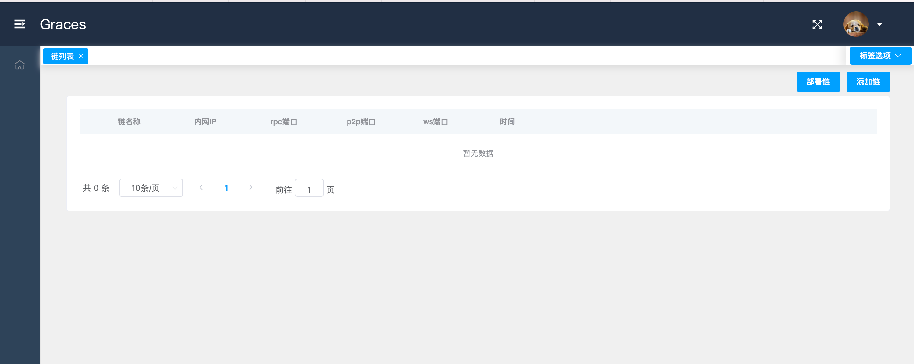
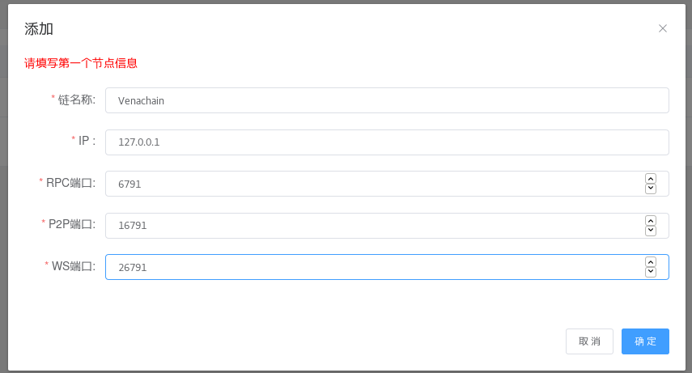
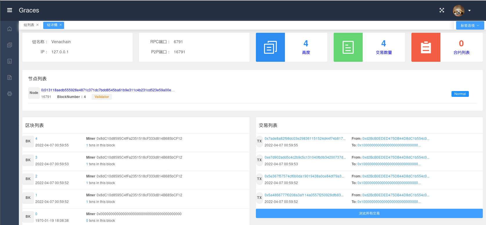
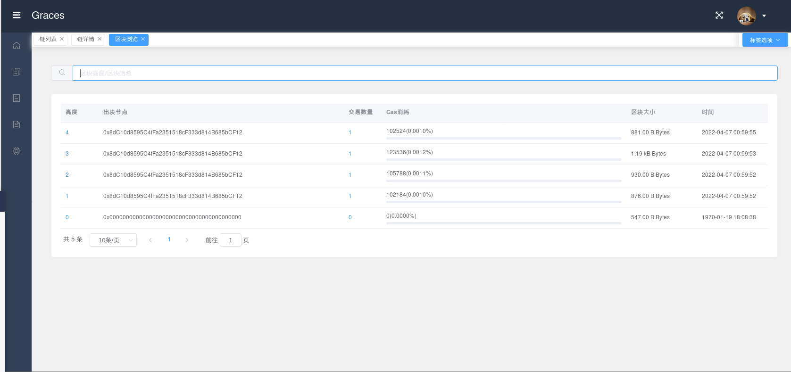
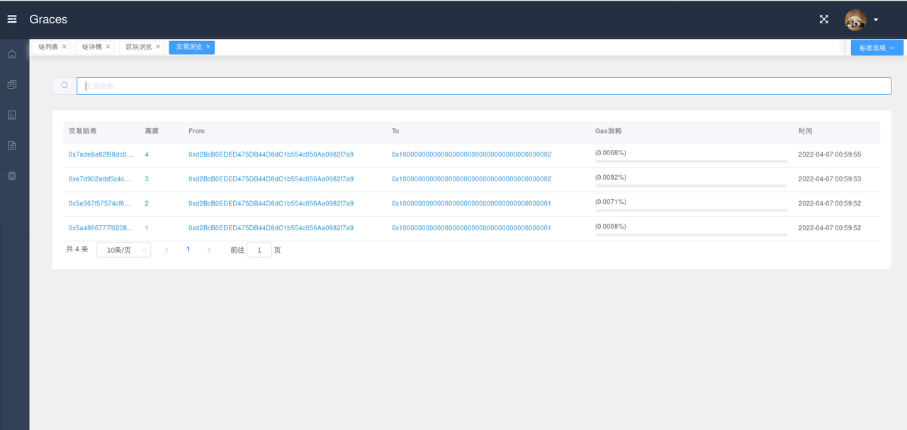
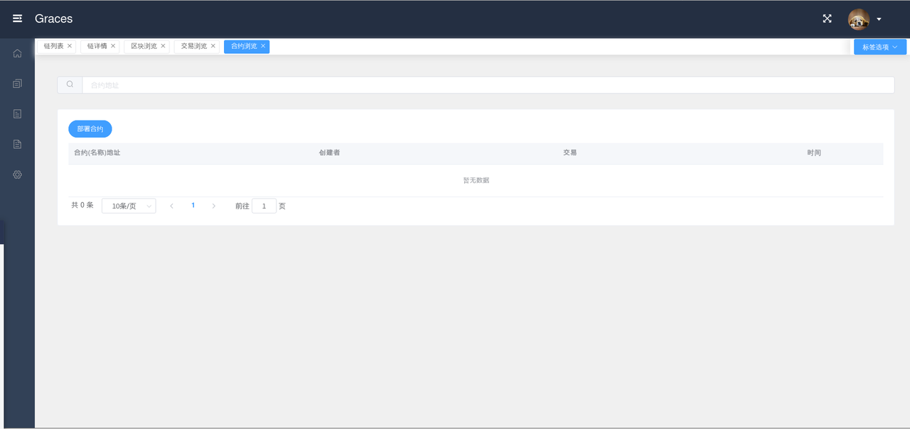
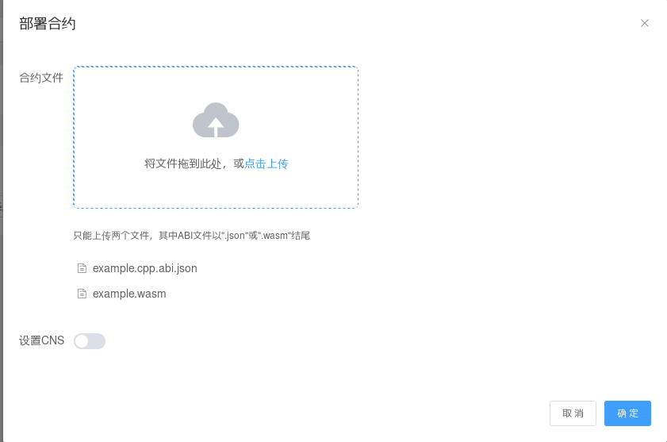
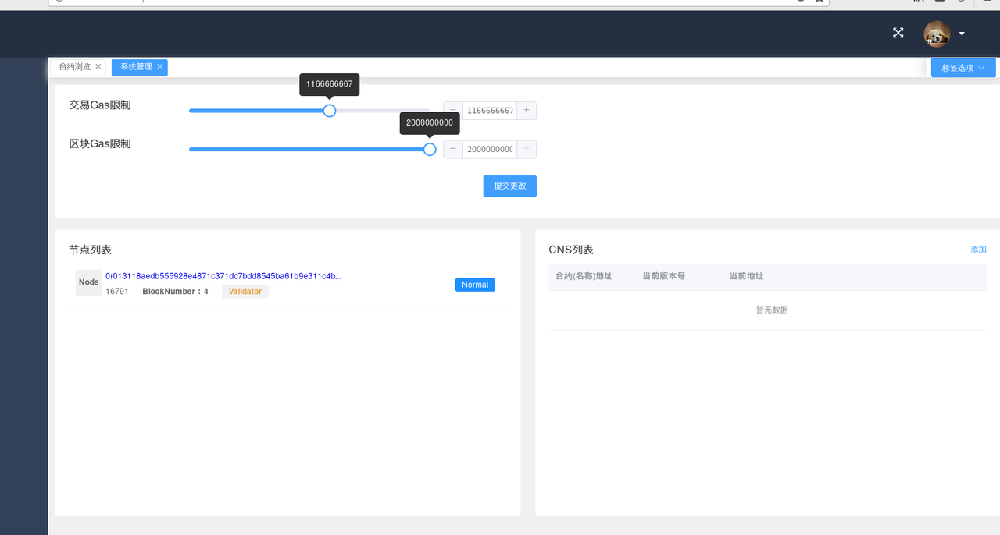

================
Graces 使用
================

1. 打开网站
=============

输入 `http://localhost:8080/ <http://localhost:8080/>`__

2. 添加链
=============

1) 先启动要添加的链，启动方法请参考 :ref:`节点部署 <normal-deploy>`

2) 点击右上角 ``添加链`` 按钮

.. figure:: ../../../images/tool/graces/addchain_1.png

3) 输入对应信息

4) 添加链成功

.. note:: 第一次添加链还需要点击 ``全量同步``

3. 使用链
=============

选择并点击要进入的链

区块浏览
^^^^^^^^^^

点击菜单栏的第二项 ``区块浏览``

可以看到区块的高度，出块节点，交易数量等信息。您也可以搜索您想要的区块高度。

交易浏览
^^^^^^^^^^^

点击菜单栏的第三项 ``交易浏览``

可以看到交易哈希，高度，交易的账户地址等信息。您也可以搜索您想要的交易哈希。

合约浏览
^^^^^^^^^^^

点击菜单栏的第四项 ``合约浏览``

点击 ``部署合约``

.. note:: 您可以上传您的合约文件（只能上传两个文件）和设置CNS。

系统管理
^^^^^^^^^^^

点击菜单栏的第五项 ``系统管理``

在这里您可以设置交易Gas限制以及区块Gas限制，提交更改后方可生效。您可以看到链上的节点列表以及CNS列表。

.. warning:: 不要轻易修改链上的配置参数