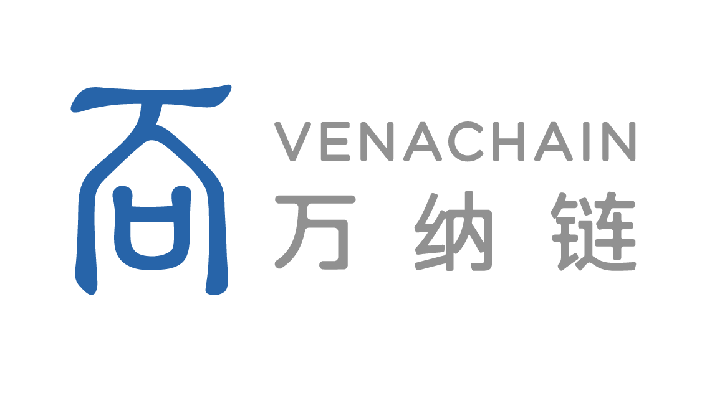

===============
Venachain 简介
===============

Venachain是 **基于隐私计算** 的新一代联盟区块链平台，以支持企业级应用。平台提出了一种以隐私计算为特色的企业级联盟链基础设施，可满足金融商业等多种需求场景。

目前Venachain提供了多种创新性技术和功能，包括：安全多方计算、同态加密等密码学技术植入、优化的高效共识、高TPS、完备、易用的企业级工具链和组件、优化的用户/权限模型、多开发语言支持等特性，旨在解决当前联盟链发展中存在的困境。

更详细的介绍请参考 `平台介绍 <documents/1_Venachain介绍/基本介绍.html>`__ 、 `应用案例 <documents/1_Venachain介绍/应用案例集/应用案例集.html>`__

资源导航
========

-  `源代码Source Code <https://github.com/Venachain/Venachain>`__
   

关注我们
========

-  `万向区块链官网 <https://www.wxblockchain.com/#/home>`__
-  `B站 <https://space.bilibili.com/28820663/>`__
-  微信公众号：万向区块链

.. toctree::
   :maxdepth: 1
   :caption: Venachain介绍
   :hidden:

   documents/1_Venachain介绍/基本介绍.md
   documents/1_Venachain介绍/应用案例集/应用案例集.md
   documents/1_Venachain介绍/常见问题解答.md

.. toctree::
   :maxdepth: 1
   :caption: 区块链部署
   :hidden:
   
   documents/2_区块链部署/获取Venachain部署包.md
   documents/2_区块链部署/Venachain部署介绍.md
   documents/2_区块链部署/Venachain部署指南.md
   documents/2_区块链部署/单机分步部署.md
   documents/2_区块链部署/多机分步部署.md
   documents/2_区块链部署/轻节点服务与客户端部署.md

.. toctree::
   :maxdepth: 1
   :caption: 智能合约
   :hidden:

   documents/3_智能合约/Wasm虚拟机合约开发指南.rst
   documents/3_智能合约/Evm虚拟机合约开发指南.rst
   documents/3_智能合约/Wasm和Evm虚拟机智能合约互调用.md
   documents/3_智能合约/隐私代币合约使用.md
   

.. toctree::
   :maxdepth: 1
   :caption: 开发帮助
   :hidden:   

   documents/4_开发帮助/RPC接口文档.rst
   documents/4_开发帮助/sdk.rst
   

.. toctree::
   :maxdepth: 1
   :caption: 实用工具
   :hidden:   
   
   documents/5_实用工具/部署工具venachainctl.md
   documents/5_实用工具/链交互工具vcl.rst
   documents/5_实用工具/密钥工具venakey.md
   documents/5_实用工具/Wasm合约开发工具Venahcain-CDT.md
   documents/5_实用工具/面向开发者的可视化链交互平台Graces.rst

.. toctree::
   :maxdepth: 1
   :caption: 深入使用指南
   :hidden:
   
   documents/6_深入使用指南/Venachain编译.md
   documents/6_深入使用指南/Venachain备份与还原.md